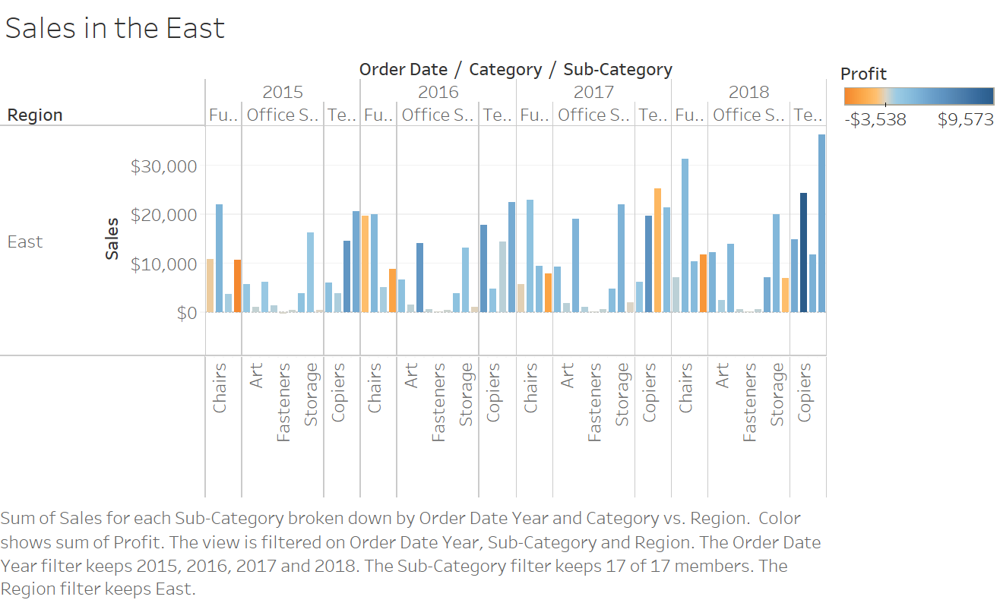
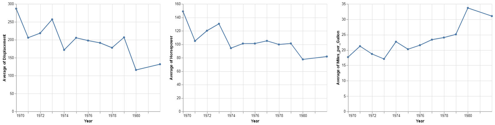

```{r setup, include=FALSE}
knitr::opts_chunk$set(echo = TRUE)
```

CS 625, Fall 2019

## Setting up R

The command below will load the tidyverse package.  If you have installed R, RStudio, and the tidyverse package, it should display a list of loaded packages and their versions.
```{r}
library(tidyverse)
```

## R Markdown 

1. *Create an ordered bulleted list with at least 3 items*
    1. Item 1
    1. Item 2
        1. Item 2.1
        1. Item 2.2
    1. Item 3

2. *Write a paragraph that demonstrates the use of italics, bold, bold italics, and code.*

  This paragraph demonstrates the use of *different text formattings* with **Markdown**. It is the ***first time ever*** writting something using R Markdown for me. Here is an example of writting a print statement in Python `print("This line will be printed.")`.

3. *Create an example of a fenced code block.*
```{r}
sqr <- function(x) {
  return(x^2)
}

print(sqr(4) + 3)
```

4. *Create a level 4 heading.*

#### <span style="color:blue"> Level 4 heading is created here. </span>

## R 

#### Data Visualization Exercises

1. *Run ggplot(data = mpg). What do you see?*
 
  I see a blank grey squre in "Plots" windown.
```{r}
library(ggplot2)
ggplot(data = mpg)
```
  
2. *How many rows are in mpg? How many columns?*
  
  ```{r}
  mpg
  ```
  According to the above result, there are 234 rows and 11 columns.
  
  
3. *What does the drv variable describe? Read the help for ?mpg to find out.*

  The help menu explains drv vaiable as below. 
  
  *"f = front-wheel drive, r = rear wheel drive, 4 = 4wd"*

4. *Make a scatterplot of hwy vs cyl.*
```{r}
theme_update(plot.title = element_text(hjust = 0.5))
ggplot(data = mpg) + ggtitle("A scatterplot of hwy vs cyl") +
  geom_point(mapping = aes(x = hwy, y = cyl))
```

5. *What happens if you make a scatterplot of class vs drv? Why is the plot not useful?*

It plot is not useful because it plots car types vs if the car is front, rare wheel drive or 4 wheel drive. Both variables that are plotted are nomimal variables. As you can see in the plot, there are only 12 dots. However, the data set contain 234 samples.  
```{r}
ggplot(data = mpg) +
  geom_point(mapping = aes(x = class, y = drv))
```

#### Workflow: basics Exercises

1. *Why does this code not work?*

```r
my_variable <- 10
my_varıable
```
The above code does not work because the second variable name uses "ı" instead of "i".

2. *Tweak each of the following R commands so that they run correctly:*

```r
library(tidyverse)

ggplot(data = mpg) + 
  geom_point(mapping = aes(x = displ, y = hwy))

fliter(mpg, cyl = 8)
filter(diamond, carat > 3)
```

```{r}
library(tidyverse)

ggplot(data = mpg) + 
  geom_point(mapping = aes(x = displ, y = hwy))

filter(mpg, cyl == 8)
filter(diamonds, carat > 3)
```


3. *Press Alt + Shift + K. What happens? How can you get to the same place using the menus?*

It opens a new window to "Keyboard Shortcut Quick Reference". You can get to the same place by go to "Tools -> Keyboard Shortcuts Help".

## Tableau

*Insert your the image of your final bar chart here*


1. *What conclusions can you draw from the chart?*

Accoriidng to the above chart, overall sales in the East keep increasing in each year. Especially in 2018, The sale number of Technology catagory reaches to the highest. As you can see from the strong navy blue color in the plot, it indicates that profit in year 2018 is also high. There is only one sub catagory with negative profit. Whereas in pervious years, there are several subcatagories with negative profits. 

## Observable and Vega-Lite

#### Intro to Observable notebook
*Insert the URL to your Observable notebook here*
https://observablehq.com/@lalitasharkey/untitled

1. *What changes did you make to the notebook?*
  * I changed numbers of the first 2 cells and observe the changed results.
  * I modified the string in the 3rd cell to "blue".
  * On the 4th cell, I changed the string, background color, and made the changed to a bold italics underlined text.
  * I changed the number in "setTimeout()" and observed the changes. Both "status" value are changed and displayed the same number. 
  * I changed the loop condition or the "generators" example from the infinite loop to only generate number up to 5,000.

2. *What happens when you select a range of items in the scatterplot at the end of the notebook?*

It creats an array of the selected objects. The result of that array displays as a list cars' names in alphabetical ordered. Each object in the result are also clickable links which open a new window to Google Image of that cars.

#### Intro to Vega-Lite notebook
*Insert the URL to your Vega-Lite Observable notebook here*
https://observablehq.com/@lalitasharkey/untitled/2


1. *What changes did you make to the notebook?*
  * I changed the the dataset to 'crimea.json'.
  * I displayed the fist 10 rows.
  * I removed some rows in weather data as well as added a "sunny" column.
  * I changed the  encoding channels from "city" to "precip".
  * I changed scale type from "log" to "pow"
  * I changed color of the 2 layered chart colors. The lines are yellow and dots are green.
  * I added one more chart to the multiple charts side-by-side example.
  * I added year to the tooltip for the interactive chart.
  * I added one more encoding to Vega-Lite JSON format section.
  

*Insert your saved chart image here*


## References

*Insert the list of sites you used as references as an unordered list with named links here.  This is required.*

* Chaning text color in Markdown language
https://stackoverflow.com/questions/35465557/how-to-apply-color-in-markdown

* How to create a function in R https://swcarpentry.github.io/r-novice-inflammation/02-func-R/

* Vega-Lite https://vega.github.io/vega-lite/docs/scale.html

* Adding title to a plot http://www.sthda.com/english/wiki/ggplot2-title-main-axis-and-legend-titles

* Center plot title https://stackoverflow.com/questions/40675778/center-plot-title-in-ggplot2

* Adding color to Markdown text

***Make sure that you Knit your R Markdown into a GitHub-readable Markdown file that is synced with your GitHub repo.***
