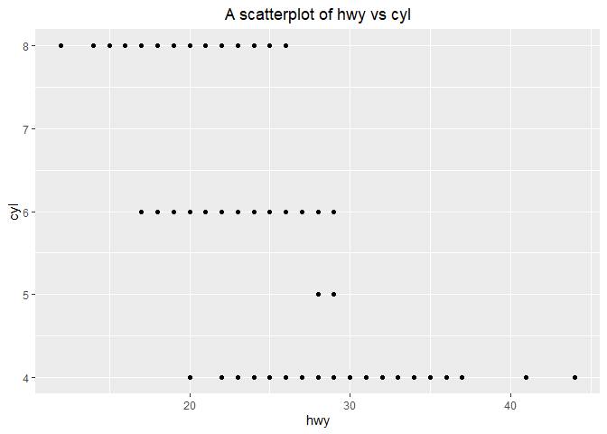

Homework 1
================
Lalita Sharkey

CS 625, Fall 2019

## Setting up R

The command below will load the tidyverse package. If you have installed
R, RStudio, and the tidyverse package, it should display a list of
loaded packages and their
    versions.

``` r
library(tidyverse)
```

    ## -- Attaching packages ----------------------------------------------------------------------- tidyverse 1.2.1 --

    ## v ggplot2 3.2.1     v purrr   0.3.2
    ## v tibble  2.1.3     v dplyr   0.8.3
    ## v tidyr   0.8.3     v stringr 1.4.0
    ## v readr   1.3.1     v forcats 0.4.0

    ## -- Conflicts -------------------------------------------------------------------------- tidyverse_conflicts() --
    ## x dplyr::filter() masks stats::filter()
    ## x dplyr::lag()    masks stats::lag()

## R Markdown

1.  *Create an ordered bulleted list with at least 3 items*
    1.  Item 1
    2.  Item 2
        1.  Item 2.1
        2.  Item 2.2
    3.  Item 3
2.  *Write a paragraph that demonstrates the use of italics, bold, bold
    italics, and code.*

This paragraph demonstrates the use of *different text formattings* with
**Markdown**. It is the ***first time ever*** writting something using R
Markdown for me. Here is an example of writting a print statement in
Python `print("This line will be printed.")`.

3.  *Create an example of a fenced code block.*

<!-- end list -->

``` r
sqr <- function(x) {
  return(x^2)
}

print(sqr(4) + 3)
```

    ## [1] 19

4.  *Create a level 4 heading.*

#### <span style="color:blue"> Level 4 heading is created here. </span>

## R

#### Data Visualization Exercises

1.  *Run ggplot(data = mpg). What do you see?*

I see a blank grey squre in “Plots” windown.

``` r
library(ggplot2)
ggplot(data = mpg)
```

<!-- -->

2.  *How many rows are in mpg? How many columns?*

<!-- end list -->

``` r
mpg
```

    ## # A tibble: 234 x 11
    ##    manufacturer model displ  year   cyl trans drv     cty   hwy fl    class
    ##    <chr>        <chr> <dbl> <int> <int> <chr> <chr> <int> <int> <chr> <chr>
    ##  1 audi         a4      1.8  1999     4 auto~ f        18    29 p     comp~
    ##  2 audi         a4      1.8  1999     4 manu~ f        21    29 p     comp~
    ##  3 audi         a4      2    2008     4 manu~ f        20    31 p     comp~
    ##  4 audi         a4      2    2008     4 auto~ f        21    30 p     comp~
    ##  5 audi         a4      2.8  1999     6 auto~ f        16    26 p     comp~
    ##  6 audi         a4      2.8  1999     6 manu~ f        18    26 p     comp~
    ##  7 audi         a4      3.1  2008     6 auto~ f        18    27 p     comp~
    ##  8 audi         a4 q~   1.8  1999     4 manu~ 4        18    26 p     comp~
    ##  9 audi         a4 q~   1.8  1999     4 auto~ 4        16    25 p     comp~
    ## 10 audi         a4 q~   2    2008     4 manu~ 4        20    28 p     comp~
    ## # ... with 224 more rows

According to the above result, there are 234 rows and 11 columns.

3.  *What does the drv variable describe? Read the help for ?mpg to find
    out.*

The help menu explains drv vaiable as below.

*“f = front-wheel drive, r = rear wheel drive, 4 = 4wd”*

4.  *Make a scatterplot of hwy vs cyl.*

<!-- end list -->

``` r
theme_update(plot.title = element_text(hjust = 0.5))
ggplot(data = mpg) + ggtitle("A scatterplot of hwy vs cyl") +
  geom_point(mapping = aes(x = hwy, y = cyl))
```

<!-- -->

5.  *What happens if you make a scatterplot of class vs drv? Why is the
    plot not useful?*

It plot is not useful because it plots car types vs if the car is front,
rare wheel drive or 4 wheel drive. Both variables that are plotted are
nomimal variables. As you can see in the plot, there are only 12 dots.
However, the data set contain 234 samples.

``` r
ggplot(data = mpg) +
  geom_point(mapping = aes(x = class, y = drv))
```

<!-- -->

#### Workflow: basics Exercises

1.  *Why does this code not work?*

<!-- end list -->

``` r
my_variable <- 10
my_varıable
```

The above code does not work because the second variable name uses “ı”
instead of “i”.

2.  *Tweak each of the following R commands so that they run correctly:*

<!-- end list -->

``` r
library(tidyverse)

ggplot(data = mpg) + 
  geom_point(mapping = aes(x = displ, y = hwy))

fliter(mpg, cyl = 8)
filter(diamond, carat > 3)
```

``` r
library(tidyverse)

ggplot(data = mpg) + 
  geom_point(mapping = aes(x = displ, y = hwy))
```

<!-- -->

``` r
filter(mpg, cyl == 8)
```

    ## # A tibble: 70 x 11
    ##    manufacturer model displ  year   cyl trans drv     cty   hwy fl    class
    ##    <chr>        <chr> <dbl> <int> <int> <chr> <chr> <int> <int> <chr> <chr>
    ##  1 audi         a6 q~   4.2  2008     8 auto~ 4        16    23 p     mids~
    ##  2 chevrolet    c150~   5.3  2008     8 auto~ r        14    20 r     suv  
    ##  3 chevrolet    c150~   5.3  2008     8 auto~ r        11    15 e     suv  
    ##  4 chevrolet    c150~   5.3  2008     8 auto~ r        14    20 r     suv  
    ##  5 chevrolet    c150~   5.7  1999     8 auto~ r        13    17 r     suv  
    ##  6 chevrolet    c150~   6    2008     8 auto~ r        12    17 r     suv  
    ##  7 chevrolet    corv~   5.7  1999     8 manu~ r        16    26 p     2sea~
    ##  8 chevrolet    corv~   5.7  1999     8 auto~ r        15    23 p     2sea~
    ##  9 chevrolet    corv~   6.2  2008     8 manu~ r        16    26 p     2sea~
    ## 10 chevrolet    corv~   6.2  2008     8 auto~ r        15    25 p     2sea~
    ## # ... with 60 more rows

``` r
filter(diamonds, carat > 3)
```

    ## # A tibble: 32 x 10
    ##    carat cut     color clarity depth table price     x     y     z
    ##    <dbl> <ord>   <ord> <ord>   <dbl> <dbl> <int> <dbl> <dbl> <dbl>
    ##  1  3.01 Premium I     I1       62.7    58  8040  9.1   8.97  5.67
    ##  2  3.11 Fair    J     I1       65.9    57  9823  9.15  9.02  5.98
    ##  3  3.01 Premium F     I1       62.2    56  9925  9.24  9.13  5.73
    ##  4  3.05 Premium E     I1       60.9    58 10453  9.26  9.25  5.66
    ##  5  3.02 Fair    I     I1       65.2    56 10577  9.11  9.02  5.91
    ##  6  3.01 Fair    H     I1       56.1    62 10761  9.54  9.38  5.31
    ##  7  3.65 Fair    H     I1       67.1    53 11668  9.53  9.48  6.38
    ##  8  3.24 Premium H     I1       62.1    58 12300  9.44  9.4   5.85
    ##  9  3.22 Ideal   I     I1       62.6    55 12545  9.49  9.42  5.92
    ## 10  3.5  Ideal   H     I1       62.8    57 12587  9.65  9.59  6.03
    ## # ... with 22 more rows

3.  *Press Alt + Shift + K. What happens? How can you get to the same
    place using the menus?*

It opens a new window to “Keyboard Shortcut Quick Reference”. You can
get to the same place by go to “Tools -\> Keyboard Shortcuts Help”.

## Tableau

*Insert your the image of your final bar chart here* 

1.  *What conclusions can you draw from the chart?*

Accoriidng to the above chart, overall sales in the East keep increasing
in each year. Especially in 2018, The sale number of Technology catagory
reaches to the highest. As you can see from the strong navy blue color
in the plot, it indicates that profit in year 2018 is also high. There
is only one sub catagory with negative profit. Whereas in pervious
years, there are several subcatagories with negative profits.

## Observable and Vega-Lite

#### Intro to Observable notebook

*Insert the URL to your Observable notebook here*
<https://observablehq.com/@lalitasharkey/untitled>

1.  *What changes did you make to the notebook?*

<!-- end list -->

  - I changed numbers of the first 2 cells and observe the changed
    results.
  - I modified the string in the 3rd cell to “blue”.
  - On the 4th cell, I changed the string, background color, and made
    the changed to a bold italics underlined text.
  - I changed the number in “setTimeout()” and observed the changes.
    Both “status” value are changed and displayed the same number.
  - I changed the loop condition or the “generators” example from the
    infinite loop to only generate number up to 5,000.

<!-- end list -->

2.  *What happens when you select a range of items in the scatterplot at
    the end of the notebook?*

It creats an array of the selected objects. The result of that array
displays as a list cars’ names in alphabetical ordered. Each object in
the result are also clickable links which open a new window to Google
Image of that cars.

#### Intro to Vega-Lite notebook

*Insert the URL to your Vega-Lite Observable notebook here*
<https://observablehq.com/@lalitasharkey/untitled/2>

1.  *What changes did you make to the notebook?*

<!-- end list -->

  - I changed the the dataset to ‘crimea.json’.
  - I displayed the fist 10 rows.
  - I removed some rows in weather data as well as added a “sunny”
    column.
  - I changed the encoding channels from “city” to “precip”.
  - I changed scale type from “log” to “pow”
  - I changed color of the 2 layered chart colors. The lines are yellow
    and dots are green.
  - I added one more chart to the multiple charts side-by-side example.
  - I added year to the tooltip for the interactive chart.
  - I added one more encoding to Vega-Lite JSON format section.

*Insert your saved chart image here* 

## References

*Insert the list of sites you used as references as an unordered list
with named links here. This is required.*

  - Chaning text color in Markdown language
    <https://stackoverflow.com/questions/35465557/how-to-apply-color-in-markdown>

  - How to create a function in R
    <https://swcarpentry.github.io/r-novice-inflammation/02-func-R/>

  - Vega-Lite <https://vega.github.io/vega-lite/docs/scale.html>

  - Adding title to a plot
    <http://www.sthda.com/english/wiki/ggplot2-title-main-axis-and-legend-titles>

  - Center plot title
    <https://stackoverflow.com/questions/40675778/center-plot-title-in-ggplot2>

  - Adding color to Markdown text

***Make sure that you Knit your R Markdown into a GitHub-readable
Markdown file that is synced with your GitHub repo.***
