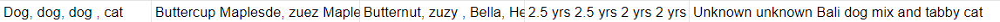
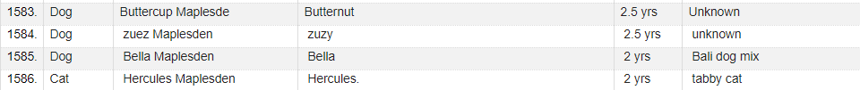
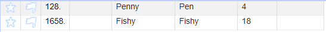
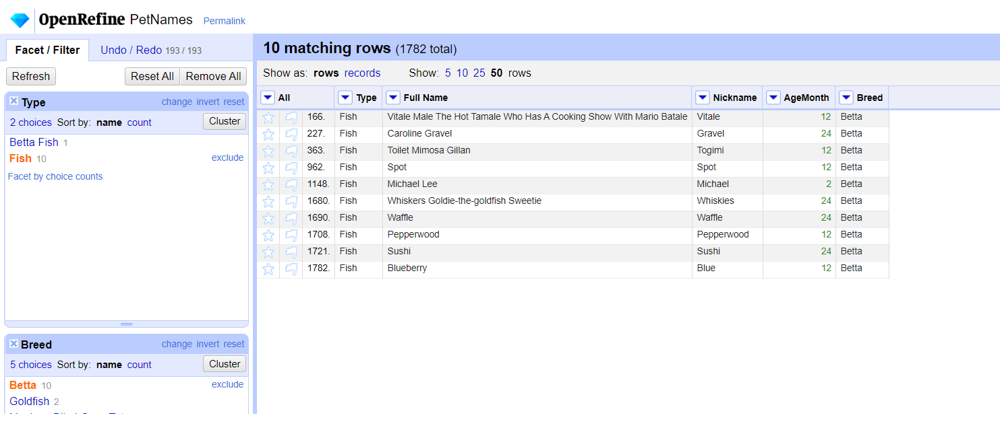
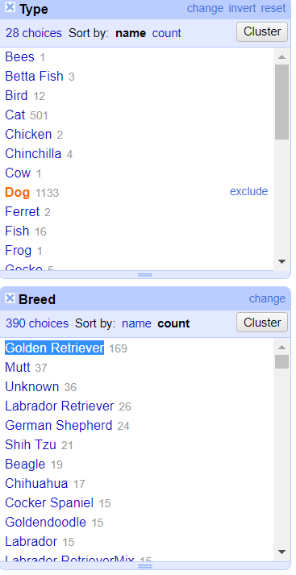

Homework 2
================
**Lalita Sharkey**  
9/10/2019

CS 625, Fall 2019

## Observed the data before cleaning

This dataset contains information about pet names. The overall observation of the dataset before cleaning is below.  
1. Number of attributes: 5  
    1. What kind of pet   
          * Text type attribute   
          * There are 83 different choices  
    2. Pet’s full name  
        * Text type attribute  
        * There are 1523 different full names  
        * Some of them are assumed to be the same name but there are some
special characters added  
    1. Pet’s everyday name  
        * Text type attribute  
        * 1367 different everyday names  
        * Some names have special characters  
    2. Pet’s age  
        * Text type attribute  
        * 220 different values
        * Many numeric values with missing units  
        * Some of them are deceased 
        * Some of the values have special characters 
    3.  Pet’s breed   
        * Text type attribute  
        * 827 different values of pet’s breed 
        * Multiple duplicate values with special characters added  
2. Number items:   
    * Number of rows: 1784   
    * Number of records: 1783   
    * One record with multiple values at Row number 1584 which contains 4 different records   
    * One blank row at row number 333

## Cleaned the data  
### Removed an empty row   
* One empty row at row number 333  
* Used “Facet by blank” option from the “All” column  
* Selected “Edit row” then “Remove all matching rows”  
* Total row number after removing empty row is 1783    	
### Renamed columns    
* Column names were very long and it could be harder when working  with GREL  
* Truncated column name as below by using “Rename this column” by using “Edit column” option  
    - **“Type”** = “What kind of pet is this (Dog, Cat, Bird, Other)”  
    - **“Full Name”** = “Pet’s Full Name (you don’t have to include your last name. Think”Winston Churchill" and not “Winston Churchill MYLASTNAME”) 
    - **“Nickname”** =  “Pet’s everyday name (e.g. ”Church“)”  
    -  **“AgeMonth”** = "Pet’s age”  
    - **“Breed”** = “Pet’s breed (if applicable)” 
        
### Split the multi-valued cell  (Extra Credit)
*  Using custom text facet on “Breed” column and put GREL as `value.contains("Unknown unknown Bali dog mix and tabby cat")`   
* Manually replaced “,” with “+++” in “Full Name”, and “Nickname” columns   *(The reason for using +++ was because I don't want to accidentally split something else without carefully observing it)*   
* Manually inserted “+++” between each value in “Age” column  
* Split “Type” column using “+++” as a separator    
*  Moved “Breed” column to be the first column
*  Split “Full Name” and “Nickname” columns using “+++” as a separator
*  Split “Age” column using “+++” as a separator
* Manually added “+++” between each breed name in “Breed” column
*  Split “Breed” column using “+++” as a separator
*  Moved “Breed” column back to be the last column  
* Checked if the results were correct  

   
  Image 1: Data before splitting  
    
   
 Image 2: Data after splitting
    
### Cleaned “Type” attribute  
* Used “Common transforms” + “To title case” to change  
* Used “Common transforms” + “Trim leading and trailing whit space”  
* Manually edited "Beta Fish" to "Better Fish" because of misspelled  
* Manually added "Dog" for row number 1693  because the value in "Breed" column is "Golden Retriever"
* Used “Cluster and edit” 
	1. Dog - 1131 rows:  
		* Dog (1117 rows)  
		* Sog (3 rows) - Assumed to be a typo  
		* Dig (1 row) - Assumed to be a typo  
         * God ( 1 row) - Assumed to be typo  
         * Dog with special characters (2 rows)  
         * Puppy (1 row) - Synonym of dog  
         * Pit Bull (1 row) - A kind of dog  
         * Doggo (1 row) - Synonym of dog  
         * Phoebe (1 row) - Checked “Breed” attribute and it was “Staffordshire Terrier”  
         * Luna (1 row) - Checked “Breed” attribute and it was “Lab”  
         * Dlg (1 row) - Assumed to be a typo
         * Mona (1 row) - Check “Breed” attribute and it was “Bluetick beagle” 
    2. Cat - 500 rows:  
          * Cat (492 rows) 
          * Cats (2 rows)   
          * ca (1 row) - Assumed typo  
          * Cat with special characters (1 row)  
          * Katze (1 row) - German for cat  
          * Kitty Meow (1 row) - Synonym of cat  
          * Car (1 row) - Assumed Typo  
          * Kitten (1 row) - Synonym of cat  
  3. Guinea Pig - 10 rows
        * Other- Guinea Pig (2 rows)
        * Guinea Pig (8 rows)
  4. Frog - 1 row
  5. Cow - 1 row
  6. Snake - 3 rows
     * Other: Snake (1 row)
     * Snake (2 rows)
  7. Prairie Dog: 
       * Other: Prairie Dog (1 row)
  8. Chinchilla   - 3 rows  
        * Chinchilla (other) (1 row)
        * Chinchilla (2 row)
  9. Hamster  - 14 rows
  10. Bees - 1 row
         * Other: Bees  (1 row)
  11. Gerbil - 2 rows
  12. Rabbit  - 16 rows
         * Bunny (4 rows) - Synonym of rabbit 
         * Rabbit (12 rows)
  13. Bird  - 12 rows
  14. Rat - 1 row  
  15. Goldfish - 6 rows  
         * Goldfish (5 rows)
         * Indoor Goldfish (1 row)
   16. Chicken - 1 row 
   17. Horse - 22 rows  
   18. Gecko  - 3 rows
          * Leopard Gecko (1 row)
          * Gecko  (2 rows)
    19. Tortoise-  2 rows
    20. Lizard  - 3 rows
    21. Turtle - 3rows
    22. Hedgehog - 2 rows 
    23. Ferret  - 2 rows
    24. Hermit Crab - 2 rows 
    25. Spider - 1 row 
    26. Spiney Leaf Insect  - 1 row
    27. Fish  
            * Other (fish)  (1 row) 
            * Fish (14 rows )
    28. Betta fish - 2 rows 
    29. Not pet 6 rows:   
             * Roomba (1 row)
             * Robot (1 row)  
             * Elephant (1 row) 
             * Virus (1 row)
             * Server (1 row)
             * Card Board Poster (1 row)
        30.  Other - 19 rows
* Cleaned "Other"
    - Used the text facet to list only "Other" type
    - After inspected the "Breed" column, found values in the column could be copied to "Type" column  
    - Used GREL `cells["Breed"].value`  to transform "Type" cell values to be the same as the values of"Breed"
    - Again used text facet and cluster to  clean up the new copied type  
      - Russian Dwarf Hamster -> Hamster  
      - Winter White Hamster -> Hamster  
      - American Guinea Pig ->  Guinea Pig  
      - Leopard Gecko -> Gecko  
      - Speckledys -> Chicken (Google Search the breed)  
      - American Standard Chinchilla - > Chinchilla  
      - Metamorphic -> Not pet (It's a kind of rock)  
      - Abyssinian Guinea pig -> Guinea Pig  
      - Mustang (horse) -> Horse  
      - Deleted a row with blanked values by deleting row number 128 only contained  values of "Full Name", "Nickname", and "Age"  
      - Manually edited row number 1658 to fish because the values of "Full Name",  and "Nickname" implied that it was a fish  
      
   
    Image 3: Blank values in "Type"  
* Removed “Not pet” rows 
    - Total of 7 rows  
    - Removed those 7 rows using “Remove all matching” row after selecting “Not pet” from text facet  
* Took a closer look at "Fish" 
    - Used text facet on "Type" and selected fish
    - Used text facet on "Breed" 
    
  
Image 4: Closer look at "Fish"

* Used GREL `cells["Breed"].value + " Fish"`  to transform "Type" cell values to changed the values in "Type" to "Betta Fish"
* Repeated the previous operation for Goldfish
### Cleaned “Full Name” attribute**   
- Used common transform to change text values to title case and trim leading and trailing white space
  - Used text facet to find (blank) and edited blank values to
        “N/A”
  - Removed the additional parentheses and texts inside in 12 cells
        by using GREL`value.replace( (/\(.*?\)/), "")` because texts in
        parentheses are only the additional explanations of “Full
        Name”  
  - Manually edited row number 1360 to “Mao” instead of “Mao. (as
        In Chairman Mao, Not Miaow Or Mayo.”
  - Transformed 18 cells by removing non-ASCII characters using GREL
        `value.replace(/[^\x20-\x7e]/, "")`  
  - Manually edited value “Mao. (as In Chairman Mao, Not Miaow Or
        Mayo.” to “Mao”
   - Removed all commas to avoid the confusion of the long full names
        with multiple names by using `value.replace(",","")`   
   - Spit "Bella Nina; Thomas James; Archie" 
      - "Nickname",  "Age", and "Breed" also contained 3 different values in each cell
    - Inspected 4 items with contains “And” or “&”
            - Used custom text facet with GREL `or(value.contains("&"),
            value.contains("And "))`
    - Record number 16 “Benny And The Jets” and record number 1376 "Heath M&m" 
            are considered to be one dog because it has one value for
            nickname and age
    - Record number 39 “Iggy And Ziggy” considered as 2 rabbits
            because the “Nickname” column contained “Igs and Zigs” and
            “Breed” column contained “Lop and angora”
    - Manually changed “And” and “and” in "“columns to”+++"
         - Spit “Full Name”, “Nickname”, and “Breed” columns using “+++” as a separator
         - Filled down “Type” column 
     - Record number 1683 “Watson & Crick” is considered to be 2 different cats because “Nickname” contained “Dr. Watson & Dr. Crick” and “Breed” column contained “a tabby and a grey cat”
         - Followed the previous steps (Record number 39) of slitting the multi-valued cell   
     ***During extended period I learned more about GREL so I added the below steps for "Full Name" cleaning. It would be more effective if I did it earlier but since I have a lot of work done already so I would like to add it here.***
     - Replaced "N/A" values with values from "Nickname" column
     - Used GREL `if(value.contains("N/A"), cells["Nickname"].value, value)`  *I could use replace but I would like to try using if() method.        
### Cleaned “Nickname” attribute**  
- Used common transform to change text values to title case and trim leading and trailing white space
- Used text facet to find (blank) and edited blank values to “Unknown”  
 - Removed the additional parentheses and texts inside in 13 cells by using GREL`value.replace( (/\(.*?\)/), "")` because texts in parentheses are only the additional explanations of “Nickname” 
  - Transformed 8 cells to remove non-ASCII characters by using GREL 
        `value.replace(/[^\x20-\x7e]/, "")`
  - Kept only one nickname for each pet in case of multiple nicknames. It was because if I spit it to different records then I feel like they could be considered as duplicates due to those records referred to the same pets.  
       - Removed any names after a comma using GREL `value.replace(/,\s.*/, "")`
       - Removed any names after Or using GREL `value.replace(/ Or\s.*/, "")`
       - Removed any names after / using GREL `value.replace(/\/.*/, "")`
       - Removed any names with " And" using GREL `value.replace(/ And.*/, "")`
       - Replaced dashes with white spaces   
### Cleaned “Age” attribute**         
* Assumed values with no units to be the year because of how people answer questions regarding age  
* Removed non-ASCII characters by using GREL `value.replace(/[^\x20-\x7e]/, "")`
 * Used text facet to located blanked cells and edited the values to "Unknown"
 * Used custom text facet to see cells contained texts by using `value.contains(/[^0-9.]/)`  
  * Manually modified:  
       * "3, WE THINK (HES A RESCUE)" to 3  
       * "16ISH" to 16
       * "14?" to 14
       * "SIX" to 6
       * "TWO" to 2
       * "13ISH" to 13
       * "1WEEK " 0.02 *Converted it to year"
       * "2 YO" to 2
       * "7 (-PICKED UP AS A STRAY)" to 7
       * "4 AND A HALF MONTHS" to 4
  * Used "To number" to transform all numeric values (no texts) to numeric data type 
  * Used numeric facet to list only values with numeric data type 
  * Used GREL to remove non-numeric characters 
       * `value.replace("YEARS", "")` 
       * `value.replace("YEAR", "")`
       * `value.replace(" YRS", "")`
       * `value.replace(" YR", "")`
       * `value.replace(" YESRS", "")`
       * `value.replace("?", "")`
 * Used GREL `value*12` to multiply all numeric data type by 12 so all year values were converted to months
 * Removed anything that refer to month(s) by using GREL 
       * `value.replace(" MONTHS", "")`
       * `value.replace(" MOS", "")`
       * `value.replace(" MO", "")`
       * ` value.replace("MOS", "")`
       * `value.replace("MO", "")`  
  * Manually modified:  
      * "10MONTHD" to 10
      * "9-10 MO" to 9.5
      * "10MONTHS" to 10
      * "6  AND 1 MONTH" to 73 *converted to month by 6 x 12 + 1*
      * "7Y 9 MO" to 93 *converted to month by 7 x 12 + 9*  
* Multiplied all numeric type values with -1 to mark them as conversion is done
     * Used "To number" to transform all numeric values (no texts) to numeric data type
     * Used numeric facet to select only positive numbers
 * Used GREL `value/4` to divide all numeric data type by 4 so all week values were converted to months
 * Used numeric facet to select only negative numbers
 * Multiplied all numeric type values with -1 to inverse the previous multiplication
 * Used the text facet to manaually edit values becuse some of them contained one or two charracters. The previous GERLs did not cover all values. For example, I maually changed "12 1/2" 
  * Used common transform to transform all text to uppercase to simplify the future work with GREL  
  * Used cluster to change some values such as 
        * Changed fractions to decimals
        * Cleaned numbers with special characters to all numeral digits
            * I think he's around 7 or 8 changed to 7.5  
            * 3-4 years changed to 3.5  
            * 9-11 changed to 10
            * We arent sure- around 8-10 changed to 9
            * Between 5 and 9 changed to 7  
        - Converted some values to "Unknown":  
            -   (1 row)
            -   ?  (1 rows) 
            -   Deceased  (7 rows)  *Only focused to the alive ones*
            -   deceased  (1 row)  
            -   Dead   (3 rows)  
            -   Dead :(   (1 row)  
            -   Unknown  (5 rows)
            -   unknown  (1 row)
            -  Died in 2008 at 12   (1 row) 
            -  She died at age 13 in 2005 :(  (1 row) 
            -  Died at 12 in 2002 (1 row)
            -  We rescued from a fountain. Unknown. (1 row)
            - 11-12 (deceased)  (1 row)
            - So So Old (1 row)
            - Unsure (1 row)
            - No Longer With Us (1 row)
            - Just Passed Away At 11 (1 row)
            - I Think They Were 11 When They Passed (1 row)
            - 4/1/02 (1 row)
            - 0 (3 rows)  
            - 4-Mar (1 row)    
            - 2,5 (1 row)
            - 1  10 (1 row)
            - 1NTH  (1 row)
            - 4-MAR (1 row)
            - 13 (CROSSED RAINBOW BRIDGE 2016)  (1 row)
### Cleaned "Breed" attribute**  
* Used common transform to change text values to title case and trim leading and trailing white space  
* Using text facet to find (blank) and edited blank values to “Unknown”  
* Removed the additional parentheses and texts inside in 13 cells by using GREL`value.replace( (/\(.*?\)/), "")` because texts in parentheses are only the additional explanations of “Breed”   
* Transformed 8 cells to remove non-ASCII characters by using GREL `value.replace(/[^\x20-\x7e]/, "")`  
* Manually changed "8 Years" to Unknown and added 8 to "Age" cell   
* Massed modified mixed breeds 
	 *  `value.replace(/\//, ", ")` was applied to selected rows in the column to replace all slashes with commas  
	 * Used GREL  `"Mixed - " + value`
     * Mixed breeds with at least 2 given breed names were reformatted to Mixed -breed_1, breed_2
          - Examples 
              -   Pit Bull/lab Mix(2 rows)
              -   Pitbull & Lab Mix(1 rows)
              -   Pitbull/lab Mix(1 rows)  
                They were reformatted to **Mixed - Pit Bull, Lab**.
      * Mixed breeds with only 1 given breed name were reformatted to Mixed - breed_1, Unknown
         - Examples
            -   Pit Bull Mix(4 rows)
            -   Pitbull Mix(3 rows)
            They were reformatted to **Mixed - Pit Bull, Unknown** 
      * Used custom text facet to explored "Breed" values that contained " And"
          * Manually changed "Lab And German Shepherd Mix" to "Mixed - Lab, German Shepherd"
          * Manually changed "Italian Greyhound And Jack Russell" to "Mixed - Italian Greyhound, Jack Russell"
          * Manually changed "Shihtzu And Mixed" to "Mixed - Shihtzu, Unknown"
          * Manually changed "Lab And Pit Mix" to "Mixed - Lab, Pitbull"
          * Manually changed "Dachshund And Tibetan Spaniel" to "Mixed - Dachshund, Tibetan Spaniel"
    * Used cluster from text facet to clean up the column   
        * Merged similar values   
            * Examples
                *   Golden Retriever(153 rows)
                -   Golden Retriever!(3 rows)
                -   Golden Retriever(1 rows)
                -   Golden Retriever!(1 rows)
                They were merged into **"Golden Retriever."** 
        - Gsd was changed to German Shepherd *Google search*
        - Dsh was changed to Domestic short-haired *Google search*
        - Dmh was changed to Domestic medium-haired *Google search*
        - Gr was changed to Golden Retriever *Google search*
        - Jack A Bee was changed to Mixed - Jack Russell Terrier, Beagle *Google search*
        - Yorkiepoo, and Yorkie Poodle were changed to Mixed - Yorkshire Terrier, poodle *Google search*
        - Woodle was changed to Mixed - Welsh Terrier, Poodle *Google search*
        - Weimeraner was changed to Weimaraner *Google search*
        - Eskimo Mix was changed to Mixed - Eskimo, Unknown *Google search*
        - Yorkie c=was changed to Yorkshire Terrier *Google search*
        - Used GREL `value.replace("Lab ", "Labrador Retriever")` to replace all "Lab\s" with "Labrador Retriever"
        - Some random values were changed to "Unknown" such as "Yes", "Street Corner", "Grey" , "Fish", "Evil", or "Mixed - Cat, He's A Cat, We Found Him On My Dad's Tire... I Think You Can Guess What Brand Tires My Dad Had"
## Questions
1.  How many types (kinds) of pets are there?  
**Answer There are 28 types of pets.**  
        1. Bees  
        2. Betta Fish  
        3. Bird  
        4. Cat  
        5. Chicken  
        6. Chinchilla  
        7. Cow  
        8. Dog  
        9. Ferret  
        10. Fish  
        11. Frog  
        12. Gecko  
        13. Gerbil  
        14. Goldfish  
        15. Guinea Pig  
        16. Hamster  
        17. Hedgehog  
        18. Hermit Crab  
        19. Horse  
        20. Lizard  
        21. Prairie Dog  
        22. Rabbit  
        23. Rat  
        24. Snake  
        25. Spider  
        26. Spiney Leaf Insect  
        27. Tortoise  
        28. Turtle    
        *To get this answer, I used text facet on "Typed".*   

2.  How many dogs?  
    **Answer There are 1133 dogs.**  
	*To get this answer, I used text facet on "Typed".*

3.  How many breeds of dogs?  
    **Answer There are 390 breeds**  
	*To get this answer, I used text facet on "Typed". I selected "Dog" then I created another text facet on "Breed". I took the number from Breed text facet window where it mentioned "390 choices".*  

4.  What's the most popular dog breed?  
    **Answer The most popular dog breed is Golden Retriever**  
	*To get this answer, I used text facet on "Typed". I selected "Dog" then I created another text facet on "Breed". I selected to sort by count option and picked the highest count number.*  

5.  What's the age range of the dogs?  
    **Answer The age range of the dogs is between 1.125 and 228 months.**     
	*To get this answer, I used text facet on "Typed". I selected "Dog". I sorted "AgeMonth" column twice to observe the highest and lowest numbers. The first time I sorted from the smallest value to the largest value and the second time I sorted from the largest to smallest.*

6.  What's the age range of the guinea pigs?  
    **Answer The age range of the guinea pigs is between  12 - 60 months.**  
	*To get this answer, I used text facet on "Typed". I selected "Guinea Pigs". I sorted "AgeMonth" column twice to observe the highest and lowest numbers. The first time I sorted from the smallest value to the largest value and the second time I sorted from the largest to smallest.*

7.  What is the oldest pet?  
    **Answer A cat is the oldest pet. Bruce Springsteen is  288 months old.**  
	*To get this answer, I used text facet on "Typed" then I sorted "AgeMoth" column from largest to smallest.*

8.  Which are more popular, betta fish or goldfish? How many of each?  
    **Answer The betta fish is more popular. There are 13 betta fish and 9 goldfish.**   
	*To get this answer, I used text facet on "Typed" then I observe the number of betta fish and 9 goldfish.*

9.  What's the most popular everyday name for a cat?  
    **Answer Kitty is the most popular everyday name for a cat.**   
	*To get this answer, I used text facet on "Typed" then I selected "Cat". I create a text facet on "Nickname" column. On the text facet window of "Nickname", I selected to sort by count option and picked the highest count number.*    

10.  What's the most popular full name for a dog?  
    **Answer Maggie is the most popular full name for a dog.**  
	*To get this answer, I used text facet on "Typed" then I selected "Cat".    I create a text facet on "Full Name" column. On the text facet window of "Full ", I selected to sort by count option and picked the highest count number.*   

   
    Image 5: Getting popular dog's full name

## References 

AnaRitaAnaRita 6711 silver badge99 bronze badges, & hpiedcoqhpiedcoq
7855 bronze badges. (1966, February 1). Split multi-valued cells in more
than one column into rows (Open Refine). Retrieved from
<https://stackoverflow.com/questions/32831582/split-multi-valued-cells-in-more-than-one-column-into-rows-open-refine>

cs625-datavis-fall19. (n.d.). cs625-datavis-fall19/assignments. Retrieved from https://github.com/cs625-datavis-fall19/assignments/blob/master/Wk2-OpenRefine-tutorial.md

(n.d.). LibGuides: OpenRefine: Splitting Cell Values. Retrieved from <https://guides.library.illinois.edu/openrefine/splitting>

OpenRefine. (n.d.). OpenRefine/OpenRefine. Retrieved from <https://github.com/OpenRefine/OpenRefine/wiki/Row-Editing>

OpenRefine. (n.d.). OpenRefine/OpenRefine. Retrieved from https://github.com/OpenRefine/OpenRefine/wiki/General-Refine-Expression-Language
