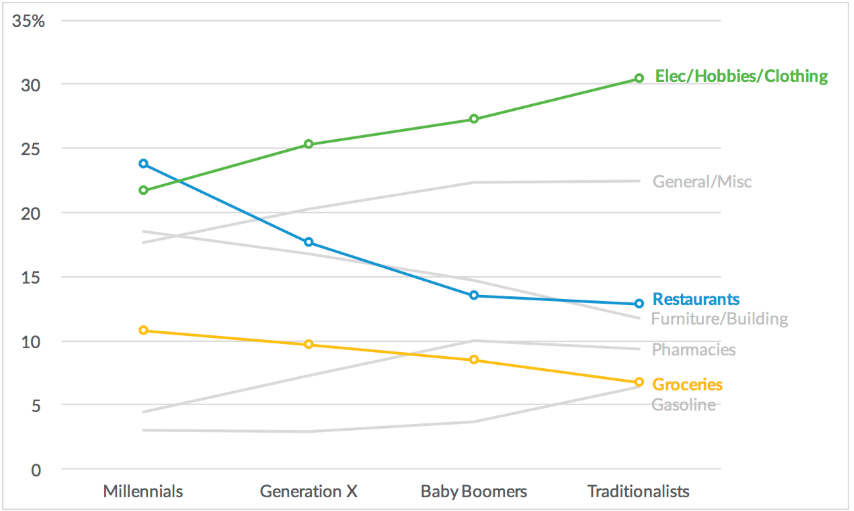
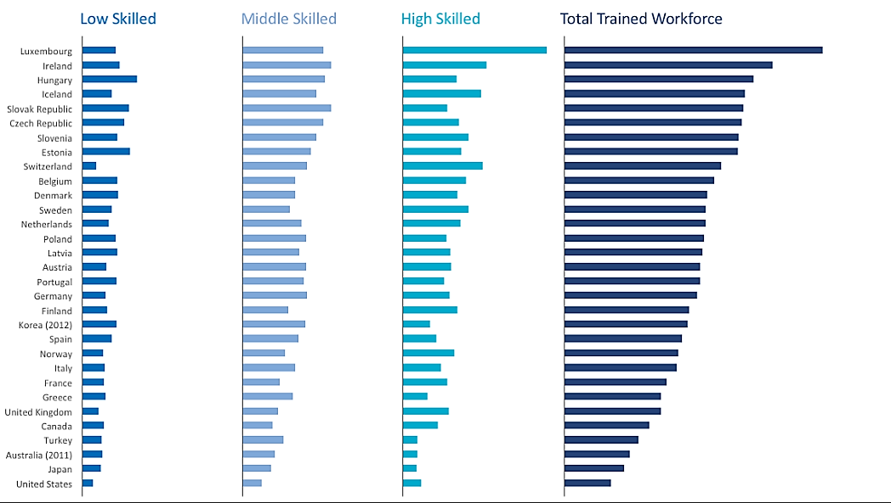

Homework 4 : Recreate Charts
================
**Lalita Sharkey**  
10/22/2019

CS 625, Fall 2019

## Part 1 - Remaking the Stacked Column Chart from Merrill Lynch (R)
### The original plot

### The replicated plot

### Initial note
I decided to choose to remake this plot using R because of the flexibility of R comparing to Excel and Tableau.
I picked R over Vega-Lite even though they both have the same flexibility only because I am more familiar with R.
The goal of this assignment is to recreate the given plots so I would rather work with something I familiar with.
Before getting my hands dirty and start coding, I did some observation using Microsoft Excel first. I found that the
given spreadsheet did not only contain the tabular data but also included a visualization. I also discover that the first column did not have a column name.
*Also, the values for Groceries for the Electronics/Hobbies are the switch but since the goal is the replicate the given plot so I swapped it just like how they did in the plot.
### Remaking this plot
1. Install `readxl` package.
2. Load the given excel files to the Tibble using `p1_data <- read_excel("PolicyViz_MerrillLynchRemake.xlsx")`.   
3. Assign a name to the first column *I found out about this step about I got an error message* `Error in is.finite(x) : default method not implemented for type 'list'` 
4. Create an empty plot using `ggplot()`.  
5. Create the **grey lines** first because this is a multiple lines plot that shares the same axes using the `geom_line()` function. If the grey lines were added to the plot after the colorful lines. the colorful lines would be crossed over by the grey lines which is not how it was in the original plot. 
  - Add some needed parameters to that function which in this case includes:  
    - Data `data = p1_data`.  
    - x, and y-axis `aes(x = Generations, y = Pharmacies)`.  
    - Line color (Grey) `g color = "#d8d8d8`.  
    - group and size `group=1, size=1.2`.  
  - Add the text label for that line using `geom_text()` function.  
  - Add parameters that will make the plot look as much the same as the original version which is similar to the parameters of the line. In this step, `hjust = 0` can be added to right justify the text.   
6. Create the colorful lines by first create the plain line just like in step 5 but change the HTML color code according to the original plot. Some online tools allow us to use the color picker and get the exact color from the original plot.  
7. Add the hallow dots on top of the colorful lines.  
   - First, create some points using `geom_point` set the shape parameter to 21 for the hallow dots
8. Modify the overall plot and panel style to make it as close to the original version as much as possible.   
   - Add proper tick lables for both axises `annotate("text", x =5.09, y = 25, label = "")`  
   - Change limit of the y axis to (0, 35) and set the major tick to increase by 5   
   `scale_y_continuous(breaks = c(seq(0, 35, by = 5)), limits = c(0, 35))`  
   - Change background color to white and add horizontal gride lines
   - Surpress the axises lables
   - Set plot margin  
  `
  g <- g + theme(panel.background = element_rect(fill = "White",colour = "White", size = 0.5, linetype = "solid"),
               panel.grid.major.y = element_line(size = 1.0, linetype = 'solid',colour = "#f2f2f2"),
               axis.title.x = element_blank(),
               axis.title.y = element_blank(),
               axis.ticks = element_blank(),
               axis.text = element_text(face = "bold", color = "#838383", size = 13),
               plot.margin = margin(.3, 3, 4, 4, "mm"),
               plot.background = element_rect(fill = "white", colour = "#d8d8d8", size = 1))
`
### Plots similarity assessment

I think both plots are pretty similar. If I have to rate it, I would say they are around 90% - 95% similar. My only 2 concerns are the length of the horizontal grid lines and the R plot lines are not so smooth. I the smooth edge of the line in R is because of the glitch or R. I think I might be able to try to work with setting the resolution of the plot but I need to read more about that. For what I have so far, I am pretty happy with it. However, I am still trying to fix the horizontal gride lines length.

### R code
The full code for this plot can be found at https://github.com/cs625-datavis-fall19/hw4-recreate-LalitaSharkey/blob/master/plots.r  
## Part 2 - Remaking an OECD Stacked Bar Chart (Tableau)
### The original plot

### The replicated plot

### Initial note
After the initial observation of the given xlxs file, I found that there were 2 different tables as well as two different plots as shown in the below image. I took the liberty of cleaning the xlxs file and deleted unwanted data. I decided to use Tableau for the second part because I would like to try to create multiple plots on the different worksheets the combine them in one dashboard.
  

### Remaking this plot
1. Load the data from the cleaned xlsx file to Tableau 
2. Add skill level to the column shelf
3. Add another skill level to the column shelf
4. Right-click on the second skill level and select dual-axis
5. Move the first column (F1) from Dimension to Rows shelf
6. Under "Mark" select "All" and select "Bar"
7. Change the color according to the original example
8. Change fronts and his the axis labels
9. Re-set the x-axis range to fixed from 0 - 85
10. Adjust the size of the bar mark
11. repeat the above steps for all needed columns
**This is how the interface looked like when creating a single plot of the small bar chart

12. Combine all plots onto a dashboard
13. Resize and reposition the plots until it looks similar to the original
14. Export the image

### Plots similarity assessment 
I would like to say my Tableau plot looks 98% similar to the original plot. Only I need to re-adjust the width of each plot precisely. For the rest of it, I feel like I got most of it. I did some research on the given plots website and found out that the font that was used in the visualizations is Calibri. I used the HTML color picker tools to get the correct HTML color codes. 

## References
https://www.rdocumentation.org/packages/openxlsx/versions/4.1.0.1/topics/read.xlsx  
https://ggplot2.tidyverse.org/reference/theme.html  
https://stackoverflow.com/questions/2678141/how-can-i-suppress-the-vertical-gridlines-in-a-ggplot2-plot  
https://community.tableau.com/thread/180415  
https://www.dummies.com/programming/big-data/big-data-visualization/how-to-create-a-tableau-dashboard/

