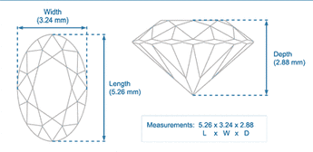
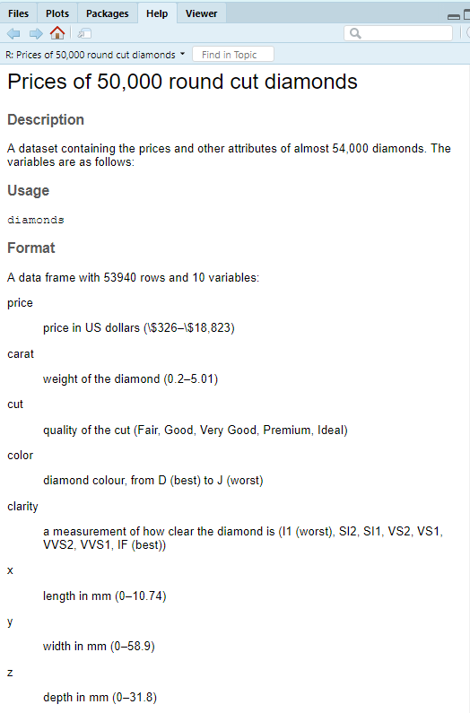

Date: 11/05/2019

```{r setup, include=FALSE}
knitr::opts_chunk$set(echo = TRUE,  fig.width = 6, fig.height = 6)
library(tidyverse)
```
## Part A - Chapter 5
```{r}
library(nycflights13)
flights
```
### 1. Look at the number of cancelled flights per day. Is there a pattern? Is the proportion of cancelled flights related to the average delay?


#### Approach
* Get number of proportion canceled flights The flights per day using `summarise` and `group_by`
  * I assume that flights that have no departure delay and arrival delay are canceled
  * If I only search for no departure or no arrival delay it can be just some uncompleted data
* Calculate mean of departure delay time and arrival delay time per day
* Pipe the results to create a scatter plot to observe the possible correlation 
* Add trend lines to emphasis if there is any trend 


```{r}
flights %>%
  group_by(day) %>%
    summarise(prop_cancelled = sum((is.na(dep_time) & is.na(arr_time)))/n(),
              avg_dpt_delay =  mean(dep_delay,na.rm=TRUE),
              avg_arr_delay = mean(arr_delay,na.rm=TRUE))%>%
  ggplot() +
  geom_point(aes(x = avg_dpt_delay, y = prop_cancelled, colour = "avg_dpt_delay")) +
  geom_point(aes(x = avg_arr_delay, y = prop_cancelled, colour = "avg_arr_delay")) +
  geom_smooth(method = "lm", se=FALSE, color="#3498DB", 
              aes(x = avg_dpt_delay, y = prop_cancelled),
              size= 0.8, linetype = "dashed", formula = y ~ poly(x, 2))+
  geom_smooth(method = "lm", se=FALSE, color="#1E8449", 
              aes(x = avg_arr_delay, y = prop_cancelled),
              size= 0.8, linetype = "dashed", formula = y ~ poly(x, 2))+
  labs(x = "Avg delay per day", y = "Proportion of Cancelled flights per day") + 
  scale_color_manual(values = c("#1E844B","#3498DB"))
```


#### Answer
According to the scatter plot, It seems to be some relationship between average delay time and canceled per day. First I looked at the plot and I felt like there could be some possible relationship between them. I first fitted the trend lined with using a linear equation but it looked underfit to me. I redrew the trend lines again with polynomial equation degree two and that confirmed my initial suspicions. There is actually a correlation here. 

### 2. Which plane `tailnum` has the worst on-time record?

#### Approach
* Group the records by tail number
* Get the delay flights records by filtering the on-time departure
* Find mean of delay flights 

```{r}
flights %>% group_by(tailnum) %>%
  filter(dep_delay > 0) %>%
  summarize(avg_delay = mean(dep_delay)) %>%
  arrange(desc(avg_delay))
```

#### Answer
According to the above records, the plane with the tail number "N844MH" has the highest average delay depart time. The average delay of this plane is 297 minutes.

### 3.  What time of day should you fly if you want to avoid delays as much as possible?
#### Approach
* Group the record by an hour
* Get the delay flights by removing the on-time records
* Calculate mean of the delay
* Sort the result by using `arrange` in increasing order

```{r}
flights %>% group_by(hour) %>%
  filter(dep_delay > 0) %>%
  summarize(avg_delay = mean(dep_delay)) %>%
  arrange(avg_delay)
```

#### Answer
In order to avoid the departure delay, I should be flying at 5 am.   
*According to list of hours, it looks like it is using the 24 hours system*

### 4. For each destination, compute the total minutes of delay. For each flight, compute the proportion of the total delay for its destination.
#### Approach
* Create a `flt_num` column which is a combination of `carrier` and `flight` columns
* Group the records by destination and flight number
* Filter out the on-time flights
* Select `dest`, `arr_delay`, and `dep_delay` columns
* Find total delay of the destination
* Find the proportion of the total delay for its destination

#### Answer

```{r}
flights$flt_num = paste(flights$carrier, flights$flight)
  
flights %>% filter(arr_delay > 0 | dep_delay > 0) %>% group_by(dest, flt_num) %>% 
  select(dest, arr_delay, dep_delay, flt_num)  %>%
  mutate(total_delay = sum(arr_delay + dep_delay, na.rm = TRUE),
         prop_delay = (arr_delay + dep_delay)/total_delay)
```

## Part B - Chapter 7
```{r}
diamonds
```
### 1. Explore the distribution of each of the `x`, `y`, and `z` variables in diamonds. What do you learn? Think about a `diamond` and how you might decide which dimension is the length, width, and depth.

#### Approach
* Plot histogram to see the distribution of each x, y, and z
* Also use rug plots attached to each histogram 
  * added after plotted all 3 histograms and found a weird range of distribution in y, and z
  * assumed to be outliers and rug plot might be able to confirm the suspicious
* Find out which parts of the diamond are the length, width, and depth
* Use both information in order to decide the description of  the `x`, `y`, and `z` variables
* Use ?diamonds to confirm the description of variables 

```{r}
library(ggpubr)
px <- ggplot(data = diamonds, mapping = aes(x = x), width = 1, higth = 1) +
  geom_bar() +
  geom_rug(colour = 'red') +
  labs(title = 'Distribution of x')

py <- ggplot(data = diamonds, mapping = aes(x = y),  width = 1, higth = 1) +
  geom_bar() + 
  geom_rug(colour = 'red') +
  labs(title = 'Distribution of y')

pz <- ggplot(data = diamonds, mapping = aes(x = z), width = 1, higth = 1) +
  geom_bar() + 
  geom_rug(colour = 'red') +
  labs(title = 'Distribution of z')

ggarrange(px, py, pz, ncol = 1, nrow = 3)
  
```
```{r}
library(ggpubr)
py1 <- ggplot(data = diamonds, mapping = aes(x = y),  width = 1, higth = 1) +
  geom_bar() + 
  coord_cartesian(xlim = c(0, 10)) +
  geom_rug(colour = 'red') +
  labs(title = 'Distribution of y with no outliers')

pz1 <- ggplot(data = diamonds, mapping = aes(x = z), width = 1, higth = 1) +
  geom_bar() + 
  coord_cartesian(xlim = c(0, 10)) +
  geom_rug(colour = 'red') +
  labs(title = 'Distribution of z with no outliers')

ggarrange(py1, pz1, ncol = 1, nrow = 2)
  
```

### Answer

The distribution of x seemed to be mostly in the range of 4 - 9. However, the distribution of y,z seemed to be unusual. I used the rug plots to confirm my suspicious if there were some outliers and I was right. I replotted both y, and z histograms without the outlier. I found out from the no outliers plots that the majority of y distribution is in between the range of 4 - 7.5. As for the distribution of z, it seemed to be around 2.5 - 5.  



Since I was not sure about how to justify the dimension of diamonds, I Google the image with clarification of which parts of the diamond are considered as length, width, and height. The combination of the information from the distribution and the above image, I would assume that x is the length, y = width, and z = depth. To verify my assumption, I used `?diamnods` to find out about the description of the data set. 



### 2. Explore the distribution of `price`. Do you discover anything unusual or surprising? (Hint: Carefully think about the `binwidth` and make sure you try a wide range of values.)

#### Approach
* Follow the given hint by creating multiple histograms

```{r}
p1 <- ggplot(data = diamonds) +
  labs(title = 'Price distribution with bin size = 1000') +
  geom_histogram(mapping = aes(x = price), binwidth = 1000)

p2 <- ggplot(data = diamonds) +
  labs(title = 'Price distribution with bin size = 100') +
  geom_histogram(mapping = aes(x = price), binwidth = 100)

p3 <- ggplot(data = diamonds) +
  labs(title = 'Price distribution with bin size = 10') +
  geom_histogram(mapping = aes(x = price), binwidth = 10)

ggarrange(p1, p2, p3, ncol = 1, nrow = 3)
```
```{r}
ggplot(data = diamonds) +
  labs(title = 'Price distribution with bin size = 10') +
  coord_cartesian(xlim = c(1000, 2500)) +
  geom_histogram(mapping = aes(x = price), binwidth = 10)

```

#### Answer
The first thing I noticed was the prices of diamond was right-skewed. The second interesting thing was if I only plotted and analyzed the first plot, I would miss an interesting gap in the price distribution. I plotted another plot and limited range values of x to be between 1,000 - 2,500 to get a closer look at the gap. Their first histogram also tricked me to believe that the price distribution was smooth. However, when I reduced the bin size, I saw numerous spikes in the price data.

### 3. How many diamonds are 0.99 carats? How many are 1 carat? What do you think is the cause of the difference?

#### Approach
* Count number of 0.99 and 1-carat diamond and compare  

```{r}
diamonds %>% filter(between(carat, .99, 1.00)) %>%
  group_by(carat) %>% summarize(count = n())
```

#### Answer
It is interesting to see the number of 0.99-carat diamonds is so small compare to 1-carat diamonds. I would assume that people tend to round up numbers as for the reason for the huge difference for both types of diamonds.  

### 4.  What variable in the diamonds data set is most important for predicting the price of a diamond? How is that variable correlated with the cut? Why does the combination of those two relationships lead to lower quality diamonds being more expensive?

####Approach
* Create the correlation matrix between all numeric variable and price
  * I was going to use "one-hot encoding" to transform all the categorical variables to numerical type but due to time constrain I might not be able to include some categorical variable into the correlation matrix
  * I felt like I might be able to use `as.numeric()` but I need to read more about this method because it could cause misleading result if it is the label encoding method 
* For the correlation between cut and most important variable for predicting the price of a diamond, I am going to use the box plot because it shows the relationship of the categorical and continuous variable

```{r}
library(corrplot)
diamonds %>%
  select(price, carat,x, y, z, depth, table) %>%
  cor() %>% corrplot(method='number')
```

```{r}
diamonds %>%
  ggplot(data = diamonds, mapping = aes(x = cut, y = price)) +
  geom_boxplot() +
  theme(axis.text.x = element_text(angle = 90 , hjust = 1)) 
```

```{r}
diamonds %>%
  ggplot(data = diamonds, mapping = aes(x = cut, y = carat)) +
  geom_boxplot() +
  theme(axis.text.x = element_text(angle = 90 , hjust = 1)) 
```


#### Answer
As for the numeric variables, `carat` has the highest correlation to price variable, therefore it is the most important variable for price prediction. I then plotted the box plot using `carat` and `cut`. According to my observation on the boxplot, the better cut has a lower carat. That is why when we look at the boxplot of cut and price, it looks like the ideal cut has a low price.  

### Extra credit: Install the `ggstance` package, and create a horizontal box plot. How does this compare to using coord_flip()?

**coord_flip()**  

```{r}
diamonds %>%
  ggplot(data = diamonds, mapping = aes(x = cut, y = carat)) +
  geom_boxplot() +
  theme(axis.text.x = element_text(angle = 90 , hjust = 1)) + coord_flip()
```

**ggstance**
```{r}
library(ggstance)
diamonds %>%
  ggplot(aes(carat,cut)) +
  geom_boxploth() 
```


#### Answer
The first had some trouble with the horizontal plot with ggstance `geom_boxploth()`. I used the same order of the aesthetics as when I made the plot using `coord_flip()` and I kept getting some straight lines. I later read the documentation about ggstance implements horizontal versions and found that I need to supply aesthetics in their natural order. Other than that, both plots look the same. 

### 5. How could you rescale the count data set above to more clearly show the distribution of cut within color, or color within cut?
```{r}
# GIVEN PLOT
diamonds %>% 
  count(color, cut) %>%  
  ggplot(mapping = aes(x = color, y = cut)) +
    geom_tile(mapping = aes(fill = n))
```

#### Approach

* The plots that were given displayed the counts of each combination of 2 categorical variables `cut` and `color`
* In order to plot the distribution of two categorical variables, I need to transform both fields by calculating the proportion of each possible combination of `cut` and `color`.
* Replot by using `fill = prop`

#### Answer


``` {r}
diamonds %>% count(color, cut) %>% group_by(color) %>%
  mutate(prop = n / sum(n)) %>%
  ggplot() +
  geom_tile(mapping = aes(x = color, y = cut, fill = prop))
```

### 6. Use `geom_tile()` together with dplyr to explore how average flight delays vary by destination and month of the year. What makes the plot difficult to read? How could you improve it?
#### Approach

* Create the average flight delays vary by destination and month of the year using `geom_tile()` then observe the result
* Find a way to improve it

```{r}
flights %>% group_by(dest, month) %>%
  summarize(avg_dep_delay = mean(dep_delay, na.rm = TRUE)) %>%
  ggplot() +
  geom_tile(mapping = aes(x = month, y = dest, fill = avg_dep_delay))
```

#### Answer
It is almost impossible to understand the above plot because :  
* It is hard to read the tick labels on the y-axis  
* There are some random empty cells which I assume them to be some missing values  
* x-axis tick labels supposed to represent months, but it seems wrong in the above plot  
* The gradient colors and the values do not make sense. The larger values have lighter colors  

There are serval things that can be done in order to improve the above plots.   
* Regroup the missing values together
* Fix x-axis values
* Select better color map  
* Resize the label on the y-axis
** I also tried to remove some missing values on the other plot **

```{r}
# Sample of my version of improvement 
flights %>% group_by(dest, month) %>%
  summarize(avg_dep_delay = mean(dep_delay, na.rm = TRUE)) %>%
  ungroup() %>%
  group_by(dest) %>%
  mutate(n_month = n()) %>%
  ggplot(cex.axis=0.05) +
  geom_tile(mapping = aes(x = factor(month),
                          y = reorder(dest, n_month),
                          fill = avg_dep_delay)) + 
  scale_fill_gradient2(low = '#ffe6e6', mid = '#ff8080', high = '#990000',
                       midpoint = 30) + 
  theme(axis.text.y = element_text(size = 3))
```

```{r}
# Sample of my version of improvement (Missing values were removed)
flights %>% group_by(dest, month) %>%
  summarize(avg_dep_delay = mean(dep_delay, na.rm = TRUE)) %>%
  ungroup() %>%
  group_by(dest) %>%
  mutate(n_month = n()) %>%
  ggplot(cex.axis=0.05) +
  geom_tile(mapping = aes(x = factor(month),
                          y = reorder(dest, n_month),
                          fill = avg_dep_delay), na_rm = TRUE) + 
  scale_fill_gradient2(low = '#ffe6e6', mid = '#ff8080', high = '#990000',
                       midpoint = 30) + 
  theme(axis.text.y = element_text(size = 4))
```


### 7. Instead of summarising the conditional distribution with a boxplot, you could use a frequency polygon. What do you need to consider when using `cut_width()` vs `cut_number()`? How does that impact a visualization of the 2d distribution of `carat` and `price`?

#### Approach
* Create 2 plots with different value of `cut_width()` vs `cut_number()` 
* Observe results  

```{r}
diamonds %>% ggplot() +
  geom_freqpoly(mapping = aes(x = price,
                              color = cut_width(carat, .1)), bins = 30)
```

```{r}
diamonds %>% ggplot() +
  geom_freqpoly(mapping = aes(x = price,
                              color = cut_width(carat, .3)), bins = 30)
```

```{r}
diamonds %>% ggplot() +
  geom_freqpoly(mapping = aes(x = price,
                              color = cut_number(carat, 10)), bins = 30)
```

##### Answer
According to my observation, if I set `cut_width` too small I ended with too many categories. For example, on the first plot I set `cut_width(carat, .1))` and I have way too many lines which were almost impossible to distinguish the color or trace each line. Later I tried setting `cut_width(carat, .3))` and the categories reduced by half. `cut_number()` on the other hand, take the number parameter and create groups of the sample according to the given parameter.

### 8. Visualize the distribution of carat, partitioned by price.

```{r}
diamonds %>% ggplot() +
  geom_density(mapping = aes(x = carat,
                             color = cut_width(price, 5000, boundary = 0))) +
  theme(legend.position="bottom",legend.direction = "vertical") + 
  scale_fill_continuous(name = "Price Partitions")
```

#### Answer
My observation is that diamonds of a higher carat are associated with a higher price in general.

### 9. How does the price distribution of very large diamonds compare to small diamonds? Is it as you expect, or does it surprise you?
                             color = cut_width(price, 5000, boundary = 0)))
```{r}
diamonds %>% ggplot +
  geom_boxplot(mapping = aes(x = cut_number(carat, 10), y = price)) 
```

#### Answer
I was surprised at all when I found out that the prices of the distribution of the larger diamonds have higher variance comparing to smaller diamonds. 

### 10. Combine two of the techniques you’ve learned to visualize the combined distribution of cut, carat, and price.

#### Answer

```{r}
diamonds %>% mutate(carat_group = cut_number(carat, 10)) %>%
  group_by(cut, carat_group) %>%
  summarize(avg_price = mean(price)) %>%
  ggplot() + 
  geom_tile(mapping = aes(x = cut, y = carat_group,
                          fill = avg_price), linetype = 'solid', colour = 'white') +
  scale_fill_gradient2(low = '#FCF3CF', mid = '#7DCEA0', high = '#0E6655',
                      midpoint = 7500)
```


### 11. Two-dimensional plots reveal outliers that are not visible in one-dimensional plots. For example, some points in the plot below have an unusual combination of x and y values, which makes the points outliers even though their x and y values appear normal when examined separately. ... Why is a scatterplot a better display than a binned plot for this case?

```{r}
# GIVEN PLOT
ggplot(data = diamonds) +
  geom_point(mapping = aes(x = x, y = y)) +
  coord_cartesian(xlim = c(4, 11), ylim = c(4, 11))
```

#### Answer
```{r}
ggplot(data = diamonds) +
  geom_bin2d(mapping = aes(x = x, y = y)) +
  coord_cartesian(xlim = c(4, 11), ylim = c(4, 11))
```

According to the above scatter plot, `x` is strongly correlated to `y`. The outliers were not too far off from the diagonal line which is where most of the point marks were. The binned plot failed to reveal this information which can be misleading. 

## References
https://ggplot2.tidyverse.org/reference/geom_smooth.html  
https://stackoverflow.com/questions/48768567/reasons-that-ggplot2-legend-does-not-appear   
https://stackoverflow.com/questions/18115550/combine-two-or-more-columns-in-a-dataframe-into-a-new-column-with-a-new-name  
https://www.tesladiamonds.com/faq.html  
https://stackoverflow.com/questions/53118181/r-highlight-cells-in-the-cor-table-that-have-a-correlation-coefficient-greate  
https://cran.r-project.org/web/packages/corrplot/vignettes/corrplot-intro.html  
https://www.ggplot2-exts.org/ggstance.html  
https://www.r-graph-gallery.com/38-rcolorbrewers-palettes.html  
https://www.r-graph-gallery.com/215-the-heatmap-function.html  
https://www.datanovia.com/en/blog/ggplot-legend-title-position-and-labels/  
https://plotnine.readthedocs.io/en/stable/generated/plotnine.geoms.geom_tile.html  
