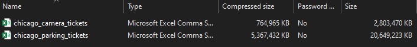
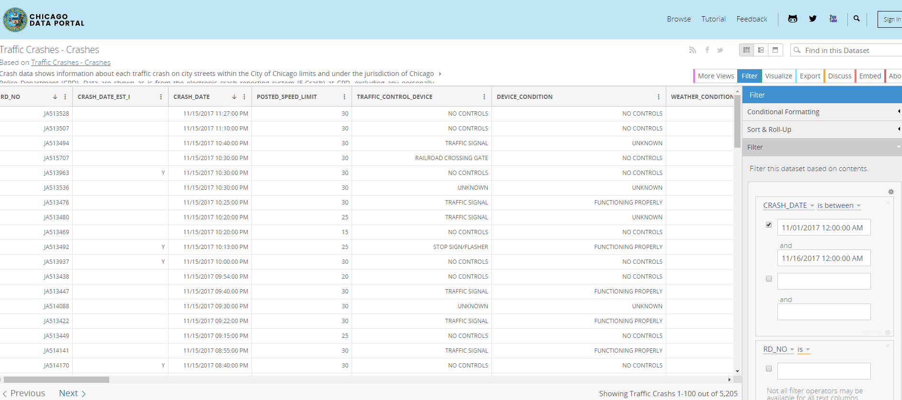
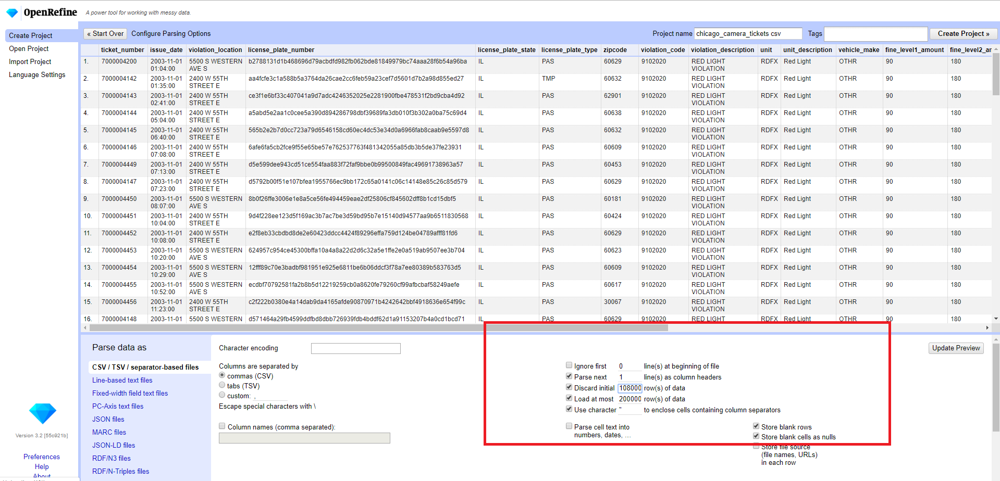
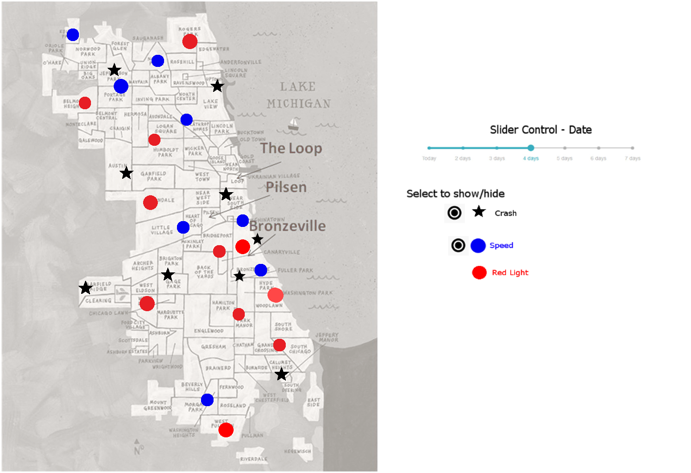
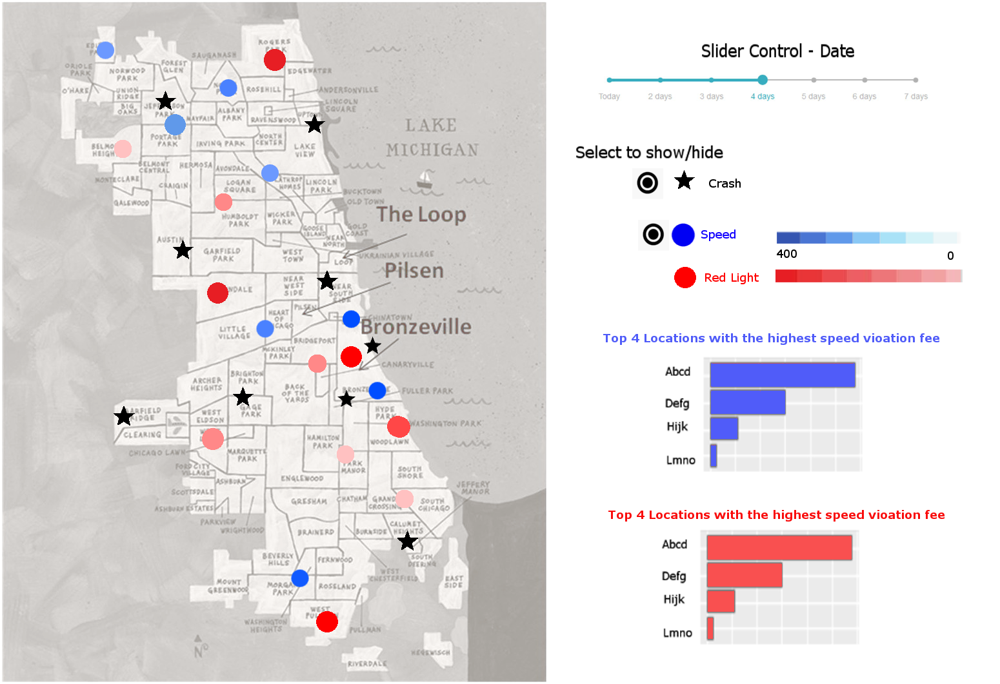

```{r setup, include=FALSE, echo = F}
knitr::opts_chunk$set(echo = TRUE, fig.align = "center")
library(readr)
library(dplyr)
library(tidyverse)
library(DataExplorer)
library(ggplot2)
```

Date: November 19, 2019  
CS 625, Fall 2019  

# Generating Questions from Real-World Data
For this homework, I will be working with datasets related to transportation data from the City of Chicago. Throughout this report, I will be developing my questions for the datasets. The ultimate goal of this assignment is for me to find an interesting story to tell through visualization from these datasets.  

*Note: I later found some plots from this library that created the interactive output in HTML format. Unfortunately, I failed to find a way to render it on the markdown output.*

## Datasets Description
I will be using 2 different datasets from two different sources. I hope to combine or augment the information from both datasets at some point to create even more complex questions.  

### Dataset 1: dataset - the City of Chicago Parking and Camera Ticket Data 
*source:  URL: https://www.propublica.org/datastore/dataset/chicago-parking-ticket-data*  

The original dataset includes 2 CSV files. As shown in figure 1, both files are very large. I picked to work with "Chicago_Camera_tickets.csv" as I find it to be more interesting compared to "Chicago_parking_tickets.csv". The Chicago Camera Tickets data contains information regarding vehicle compliance tickets issued in Chicago. I use OpenRefine to trim the data into a smaller size and reorganized the data. The data size reduction details are going to be discussed in "Data Cleaning" in the "EDA Process" section. 



*Figure 1 - The original dataset*  

### Dataset 2: dataset - City of Chicago Traffic Crashes  
*source:  URL: https://data.cityofchicago.org/Transportation/Traffic-Crashes-Crashes/85ca-t3if*  

Traffic Crashes data includes information about each traffic crash on city streets within the City of Chicago limits and under the jurisdiction of the Chicago Police Department (CPD). While extracting the crashes data from the Chicago Data Portal, I use the filter to only export the data with in the same range as the samples from the Camera Tickets data. As depicted in figure 2, I filter the crash data by selecting only when the `CRASH_DATE` is in between 11/01/2017 and 11/16/2017.



*Figure 2 - Filter set up when exporting the Crashes Data*  

## EDA process

While I did some reading about the EDA process and R, I came across `DataExplorer`. It is a very powerful library for data exploration. Therefore I will be using this library in this homework.

### Initial Data Cleaning
#### Dataset: The City of Chicago Parking and Camera Ticket Data 

As I mentioned early in this report, I use OpenRefine to reduce the size of the dataset by only selecting a chunk of samples as well as data cleaning and re-organize the data for further exploration.  

As I mentioned early in this report, I use OpenRefine to reduce the size of the dataset by only selecting a chunk of samples as well as data cleaning and re-organize the data for further exploration.  

**Cleaning Steps**  

  * According to figure 3 below, before creating a project, I configure  OpenRefine to discard initial 10,800,000 rows and only read 200,000 samples    
  * Sort the `issue_date` column  
  * Use custom text facet for filtering the samples in between 11/01/2017 and 11/16/2017  
    * `value.contains("2017-11")`  
    


*Figure 3 - Using OpenRefine to reduce the dataset size*

### Variables

#### Dataset 1: dataset - the City of Chicago Parking and Camera Ticket Data

I will be using `str` to display the structure of this dataset to get a better understanding.

```{r}
cam_data <- read.csv(file="data/camera_tickets.csv", sep=",", header = T)
str(cam_data)

```

According to the above result, there is 54,063 number of samples with 25 variables. I notice some interesting variables which can be used in creating the questions. For example, I find these three fields `violation_location`, `violation_description`, and `current_amount_due` to be very useful. However, I would like to look at the second dataset before finalizing my initial questions as I believe I might be able to come up with more complex questions when using information from both datasets.

To get introduced to the dataset, I will be using the `plot_into()`.

```{r}
plot_intro(cam_data)
```

I find it is interesting that there are no missing observations in this dataset. I feel suspicious about this. I will need to look further into this matter.

#### Dataset 2: dataset - City of Chicago Traffic Crashes

Once again, I will be using `str` to display the structure of the dataset.

```{r}
crsh_data <- read.csv(file="data/Traffic_Crashes.csv", sep=",", header = T)
str(crsh_data)
```

This dataset contains 5205 samples with 48 variables. My main interest is the location of the crashes. I believe it can be used to augment or layer on top of the location data from the camera ticket. `CRASH_DATE` will also be used as one of the merge condition. I think it will be interesting to create a map visualization with animation on different dates. Another thing I find interesting from the list of variables is the information of working zones. However, it looks like it needs to be cleaned first.


```{r}
plot_intro(crsh_data)
```

As shown in the above introduction plot, there are 64.3% of the dataset that are not completely missing. Given the 64.3% complete rows, there are only 0.8% total missing observations.

### Initial Detailed Questions (1 - After observing Variables)

I came up with numerous questions from the information of both datasets. I only list some that I find interesting and a little more complexed. Here are some initial questions after inspecting both datasets and their variables:  

  * Which area in the City of Chicago has the highest fine rate for each violation type and is it correlated to the number of crashes?  
  * Are there any correlations between violation location and time that contributes to the number of each violation type? 
  * For each location, Are there any correlations between the speed limit and the most severe injury?  
  * For each location and date, is there any correlation between the number of each violation type and the number of crashes?

### Missing Values

#### Dataset 1: dataset - the City of Chicago Parking and Camera Ticket Data
I would like to investigate further for my prior suspicion regarding the 0% missing observation. I will be using  `plot_missing()` to double-check this finding.

```{r}
plot_missing(cam_data)
```

The above plot confirms the finding from the introduction plot. All columns contain no missing rows. 

#### Dataset 2: dataset - City of Chicago Traffic Crashes
Next, I would like to use the same missing plot to observe the percentage of missing rows in each column.

```{r, fig.height = 9, fig.width = 8}
plot_missing(crsh_data)
```

From the above chart, the `LANE_CNT` variable has the highest missing rows. However, it is only 335.33% which still considers being in an OK range.

### Distributions 

I will visualize the frequency distributions for all discrete features for both datasets by using `plot_bar()`. The column with more than 50 categories will be ignored in this type of plot. For the continuous variables, I will be using `plot_histogram()` to visualize the distributions.

#### Dataset 1: dataset - the City of Chicago Parking and Camera Ticket Data
I will also ignore `licence_plate_state` column as it does not in the scope of my interests. 

```{r, fig.height = 8}
cam_data <- drop_columns(cam_data, "license_plate_state")
plot_bar(cam_data)
```

The above plot suggests that are could be some variables that can be considered as duplications because of the similarities in distributions:  

  * `violation_code` and `violation_description`  
  * `unit`, `unit_description`, and `officer` 
  

Next, I will observe the distributions of continuous columns.

```{r}
plot_histogram(cam_data, ncol = 3L)
```

According to the above histogram, I decided to drop `notice_number`. I also realized that `month`, and `year` are not continuous. I will convert it to the categorical data type.

```{r}
cam_data <- drop_columns(cam_data, "notice_number")
cam_data <- update_columns(cam_data, "month", as.factor)
cam_data <- update_columns(cam_data, "year", as.factor)
```

#### Dataset 2: dataset - City of Chicago Traffic Crashes

Observing the categorical variables distribution of City of Chicago Traffic Crashes data by using bar plots.

```{r}
crsh_data1 <- drop_columns(crsh_data, c("PRIM_CONTRIBUTORY_CAUSE", "SEC_CONTRIBUTORY_CAUSE", "INJURIES_UNKNOWN"))
plot_bar(crsh_data1, ncol = 2L , nrow = 2L)
```

Early in this report, I thought the information about work zones was interesting. After inspecting the distributions, I realized that most of the values for `DOORING_I`, `WORK_ZONE_I`, `WORK_ZONE_TYPE`, and `WORKers_PRESENT_I` contain empty string values which are not useful in the analysis.  Therefore, I will be dropping in these fields. 

```{r}
crsh_data <- drop_columns(crsh_data, c("DOORING_I", "WORK_ZONE_I", "WORK_ZONE_TYPE", "WORKERS_PRESENT_I"))
```

Next, I will observe the distributions of continuous variables.

```{r}
plot_histogram(crsh_data, ncol = 3L, nrow = 2L)
```

There are serval variables that needed to be changed from continuous data type to categorical type.

```{r}
crsh_data <- update_columns(crsh_data, "CRASH_MONTH", as.factor)
crsh_data <- update_columns(crsh_data, "CRASH_DAY_OF_WEEK", as.factor)
crsh_data <- update_columns(crsh_data, "STREET_NO", as.factor)
```

### Initial Detailed Questions (2 - After observing distributions)

After a careful inspection of the distributions, I will update the initial detailed questions as necessary. 

**Remove:**  

  * For each location, are there any correlations between the speed limit and the most severe injury?  
    (This question is removed because of the distribution of `MOST_SEVERE_INJURY`. Almost 90% of this column's values are `NO INDICATION OF THE INJURY` which is not going to be useful for the visualization.) 

**Keep:**

  * Which area in the City of Chicago has the highest fine rate for each violation type and is it correlated to the number of crashes?  
  * Are there any correlations between violation location and time that contributes to the number of each violation type? 
  * For each location and date, is there any correlation between the number of each violation type and the number of crashes?

### Correlation analysis
I will be using a correlation heatmap for all non-missing features to visualize the correlation. I will separate the correlation heatmaps by features type. 

#### Dataset 1: dataset - City of Chicago Parking and Camera Ticket Data
#### Continuous Data
```{r, fig.height = 4, fig.width = 4}
plot_correlation(na.omit(cam_data), maxcat = 6L, type = "c")
```

#### Categorical Data

```{r, fig.height = 8, fig.width = 7}
plot_correlation(na.omit(cam_data), maxcat = 6L, type = "d")
```


#### Dataset 2: dataset - City of Chicago Traffic Crashes

```{r, fig.height = 12, fig.width = 10}
plot_correlation(na.omit(crsh_data), maxcat = 7L, type = "d")
```

#### Categorical Data

```{r, fig.height = 7, fig.width = 7}
plot_correlation(na.omit(crsh_data), maxcat = 7L, type = "c")
```

### Initial Detailed Questions (3 - After observing correlation)

From the heatmaps, there are no obvious relationships between any variables. Therefore, I am going to keep all initial detailed questions and hopefully, I will find something interesting by augmenting 2 datasets together.  

  * Which area in the City of Chicago has the highest fine rate for each violation type and is it correlated to the number of crashes?  
  * Are there any correlations between violation location and time that contributes to the number of each violation type? 
  * For each location and date, is there any correlation between the number of each violation type and the number of crashes?

## Augmented Data

I am going to merged some interesting columns which I consider them to be useful for the 3 initial detailed questions. 

```{r}
cam_data$date  = as.Date(substr(cam_data$issue_date, 0, 10), format = "%Y-%m-%d")
crsh_data$CRASH_DATE <- gsub("/", "-", crsh_data$CRASH_DATE)
crsh_data$date = as.Date(substr(crsh_data$CRASH_DATE, 0, 10), format = "%m-%d-%Y")
crsh_data <- transform(crsh_data, location=paste(STREET_NO, STREET_DIRECTION, STREET_NAME, sep=" "))

new_crs_data <- subset(crsh_data, select = c(date, location, RD_NO, DAMAGE, PRIM_CONTRIBUTORY_CAUSE))
new_cam_data <- subset(cam_data, select = c(ticket_number, date, violation_location, violation_description, current_amount_due))

merged_data <- merge(new_cam_data, new_crs_data, by.x = c("date", "violation_location"), by.y = c("date","location"), all = F)
```

All three of my initial detailed questions are revolving around finding correlations, therefore I am going to create a correlation heatmaps for merged by date dataset becuase it has the largest number of samples.

```{r, fig.height = 7, fig.width = 7}
plot_correlation(na.omit(merged_data), maxcat = 7L)
```

Once again, I do not see any obvious correlation in the dataset even after merged the two datasets.

## Final Detailed Questions  

I decide to pick the final 2 detailed questions based on the compexities of the questions and how I believe the visualization of both plots will tell some good stroies.

  * Which area in the City of Chicago has the highest fine rate for each violation type and is it correlated to the number of crashes?  
  * For each location and date, is there any correlation between the number of each violation type and the number of crashes?

## Draft charts

I will be using Gimp as a tool to create the sketch of draft charts. 

### 1. For each location and date, is there any correlation between the number of each violation type and the number of crashes?


#### Charts Encoding:  

1.Mark: 

  * Shapes   
    * Star - Crash  
    * Circles - Violation 
      
2.Channels: 

  * Colors - Violation Types  
  * vertical and Horizaontal Spatial positions - 2D locations  
  
#### Chart Description
My ultimate goal is to plot the samples of each interested variables on the actual map of the City of Chicago. I believe I might actually discover some correlation from this plot using the spatial position. If there are any correlations, I should be able to see the cluster of both shapes of marks in almost the same area. Since the question mentions each violation type, different colors will be used on the circle marks for distinction. I always wanted to try creating an interactive plot. So, I added 2 features for the users to be able to use the slider to observe the visualization on different dates. I also hope to add checkboxes for the user to control the visibility of each mark.


### 2. Which area in the City of Chicago has the highest fine rate for each violation type and is it correlated to the number of crashes?  


#### Charts Encoding:  

1.Mark:

  * Shapes   
    * Star - Crash  
    * Circles - Violation  
      
2.Channels:  

  * Colors - Violation Types  
  * Color satuarion - Fine rate  
  * vertical and Horizaontal Spatial positions - 2D locations  
  
#### Chart Description
I did not realize that the second detailed question was in fact built upon the first detailed question. Other than using the color saturation, this plot is also a multiple views plot. I would like to emphasis "Which area in the City of Chicago has the highest fine" part of this detailed question by including 2 horizontal bar charts. Both charts depict the highest fine fee for each violation type.   

### Post drafts sketching notes 

1. I feel like I could use the information regarding population density in Chicago to create the Choropleth Map. The quantitative value of the number of population can be encoded as sequential color over regions delimited as area marks.   
2. I might be able to add more information into the plots by using instead of just using the plain circle marks. I could turn those circles into multiple pie charts. 
3. Since the user has to use the slider to observe the violation day by day, I figure I could add a summary chart that contains the average information on the map of Chicago. It will provide average information within the range of samples period to the users.


## Appendix
This section contains some plots that I created but failed to embed it in the markdown of the report.  I need to learn how to render the HTML  widget on the markdown file. However, I feel like the plots look interesting so I would like to add it to my report.  

### Structure plot of Camera Tickets and Traffic Crashes datasets 
Path to HTML file: (https://github.com/cs625-datavis-fall19/hw7-questions-LalitaSharkey/blob/master/img/plt.html)  

```
data_list <- list(cam_data, crsh_data)
plot_str(data_list)
```

<a href="http://localhost:21258/session/viewhtml56f41b8d1c1a/index.html"> Click for the Structure plot of Camera Tikets Data and Traffic Crashes datasets  </a>

# References  
https://boxuancui.github.io/DataExplorer/    
https://rmarkdown.rstudio.com/articles_interactive.html  
https://dzone.com/articles/learn-r-how-create-data-frames  
https://www.rdocumentation.org/packages/DataExplorer/versions/0.8.0  
https://clayford.github.io/dwir/dwr_05_combine_merge_rehsape_data.html  
https://stackoverflow.com/questions/27906021/merge-2-columns-into-one-in-dataframe  
https://cran.r-project.org/web/packages/DataExplorer/vignettes/dataexplorer-intro.html  
https://www.rdocumentation.org/packages/DataExplorer/versions/0.6.0/vignettes/dataexplorer-intro.Rmd  
https://stackoverflow.com/questions/22030252/duplicate-a-column-in-data-frame-and-rename-it-to-another-column-name  