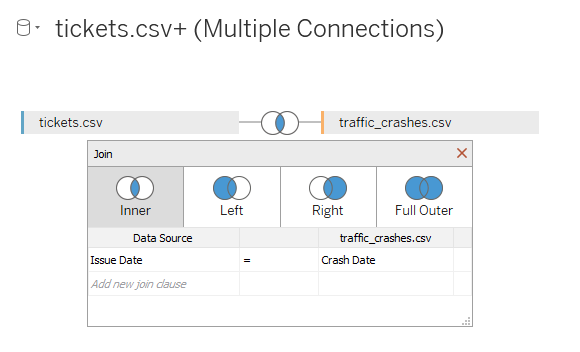
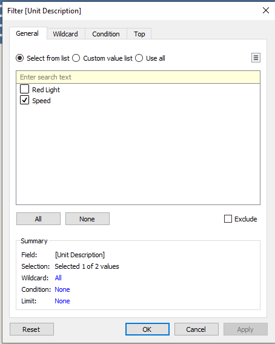
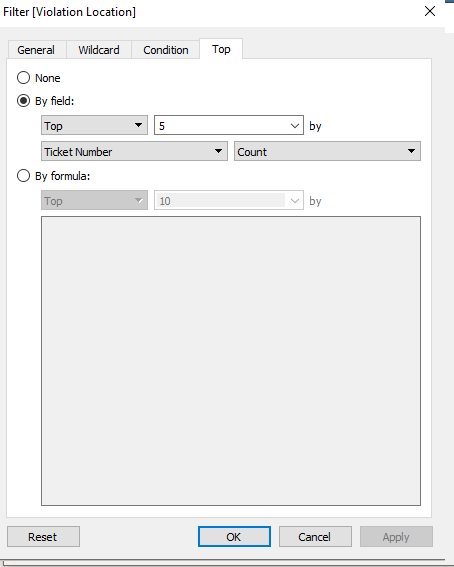
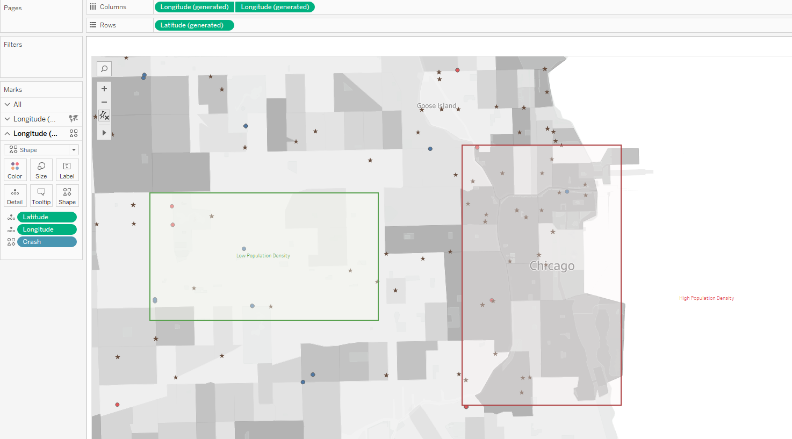
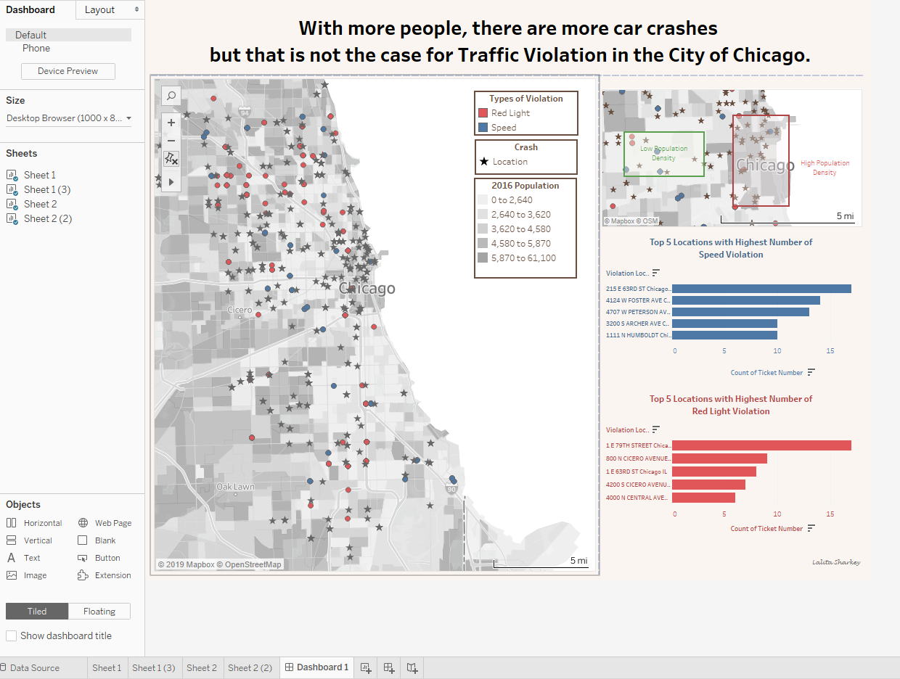

Homework 8: Refine Chart
================
Lalita Sharkey
12/02/19

## A selected questions and plot from Homework 7

#### Question: For each location, is there any correlation between the number of each violation type and the number of crashes?

## Suggestion from Dr. Weigle

The goal here is to make a finding and present it. With a slider, you’re
allowing more of an analysis/exploration by the user. What is the main
finding of your exploration of the data? If you want to show a map,
you’ll need to also consider population (there will naturally be more
violations/crashes in highly populated areas). This may be more than you
can do in a week and is really more than what I’m asking for.

## The Refined Chart

### Chart Explanation

According to the refined chart above, there are some cluttered of starts
which in this chart are the car crash locations. Once take a closer
look, the cluttered of stars lay on top of the darker shade of grey
which are the area with high population denstity. The observation
implies that the higher number of population in an area has a strong
correlation to the number of car crashes. To emphasis, a zoomed plot
with the annotated area of both high and low population density was
created. However, the same can not be said regarding the number of
traffic violations. To illustrate, In the high population density frame
in zoomed plot, there are only a few traffice violation tickets had been
issused. Whereas in the low population density frame, the number of
traffic violation tickets is smaller comparing to the high population
density area. Since the question asks for the correlation between the
number of each violation type and the number of crashes for each
location, I believe this chart answers the question pretty well.

## Making the refined chart

I created the refined version of the chart by mainly using Tableau. The
reason for using Tableau is because I did the dashboard plot where it
combines multiple charts. I also found a simple way to create a map with
Tableau. Furthermore, I also found out that Tableau has a built-in data
layer option where it directly imports population data to the map.

**1. Used Python script with `geopy` to change violation address to
latitude and longitude coordinates**

    from geopy.geocoders import Nominatim
    from geopy.extra.rate_limiter import RateLimiter
    
    rep = pd.read_csv('https://raw.githubusercontent.com/cs625-datavis-fall19/hw8-refine-LalitaSharkey/master/data/tickets.csv?token=ANAIY6L2JJV5XN5GYBI7XO255XP4Y')
    rep.head()
    
    geolocator = Nominatim(user_agent="tickets")
    geocode = RateLimiter(geolocator.geocode, min_delay_seconds=1)
    rep['violation_location'] = rep['violation_location'].map(str) + "Chicago IL"
    rep['location'] = rep['violation_location'].apply(geocode)
    rep['point'] = rep['location'].apply(lambda loc: tuple(loc.point) if loc else None)
    get_rows = rep.point.notnull()
    rep[['lt', 'ln', 'other']] = rep[get_rows].apply(lambda x:x.point,result_type='expand',axis=1)
    
    with open('filelocation.csv', 'w') as f:
        rep.to_csv(f, encoding='utf-8', index=False)

**2. Imported the datasets to Tableau and join both table**

**3. Moved generated latitude and longtitude to the shelfs**

**4. Set the map layer**

**5. Added marks to the chart**

**6. Create horizontal bar charts on another worksheets**

To select only top 5 locations for each category, the filter option was
used for 2 dimensional varibles which are `Unit Description` and
`Violation Location`.

**7. Created the zoomed plot with annotated population density areas**

**8. Combined all worksheets into one dashboard and added the headline**

## References

<https://community.tableau.com/thread/179770>  
<https://community.tableau.com/thread/294980>  
<https://help.tableau.com/current/pro/desktop/en-us/maps_dualaxis.htm>  
<https://help.tableau.com/current/pro/desktop/en-us/maps_howto_simple.html>
