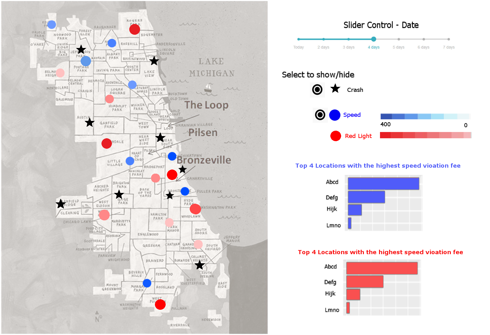
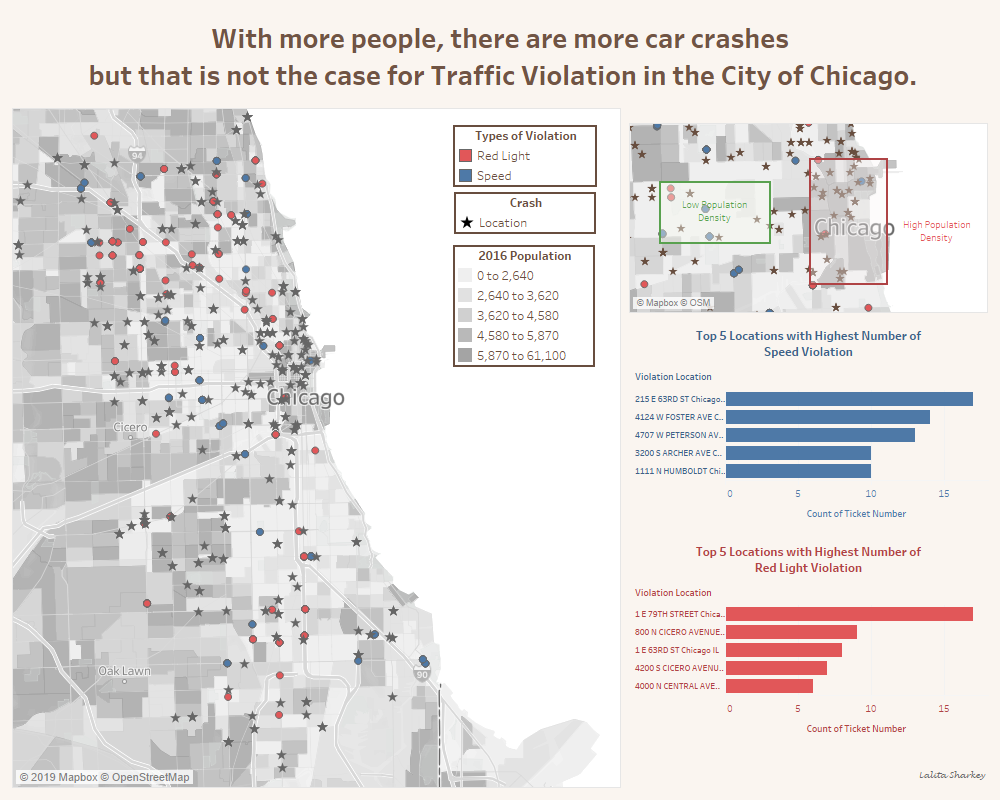
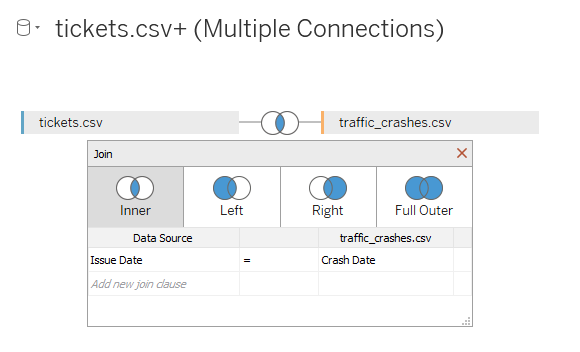
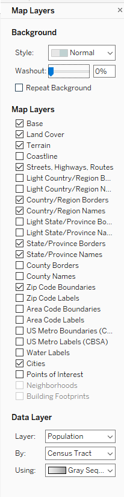
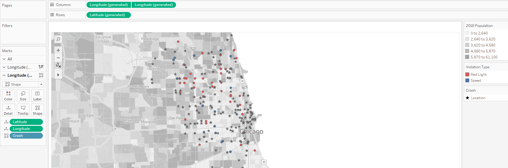
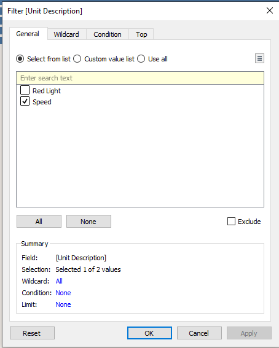
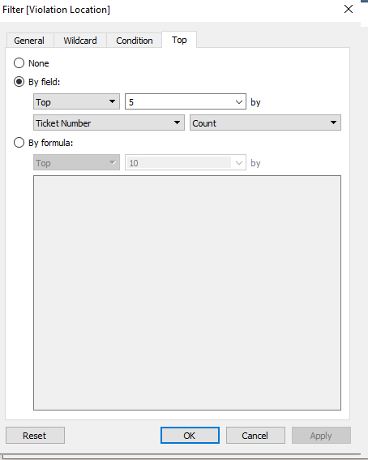
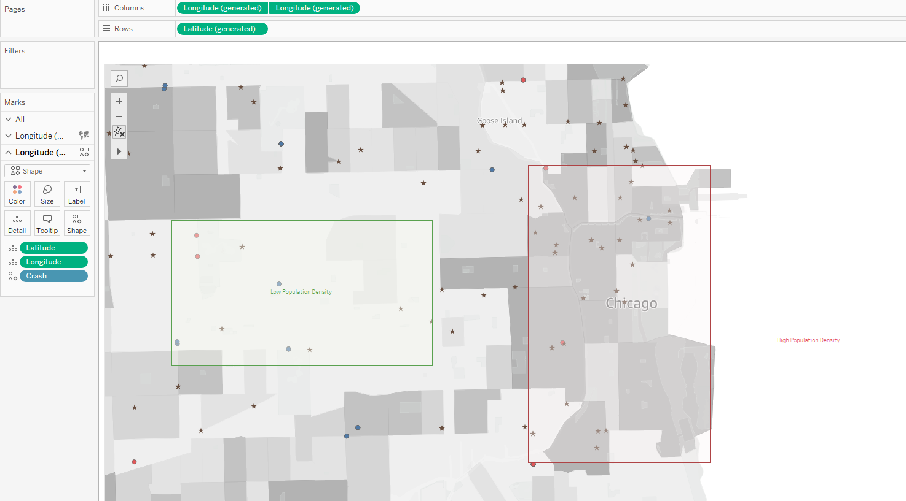
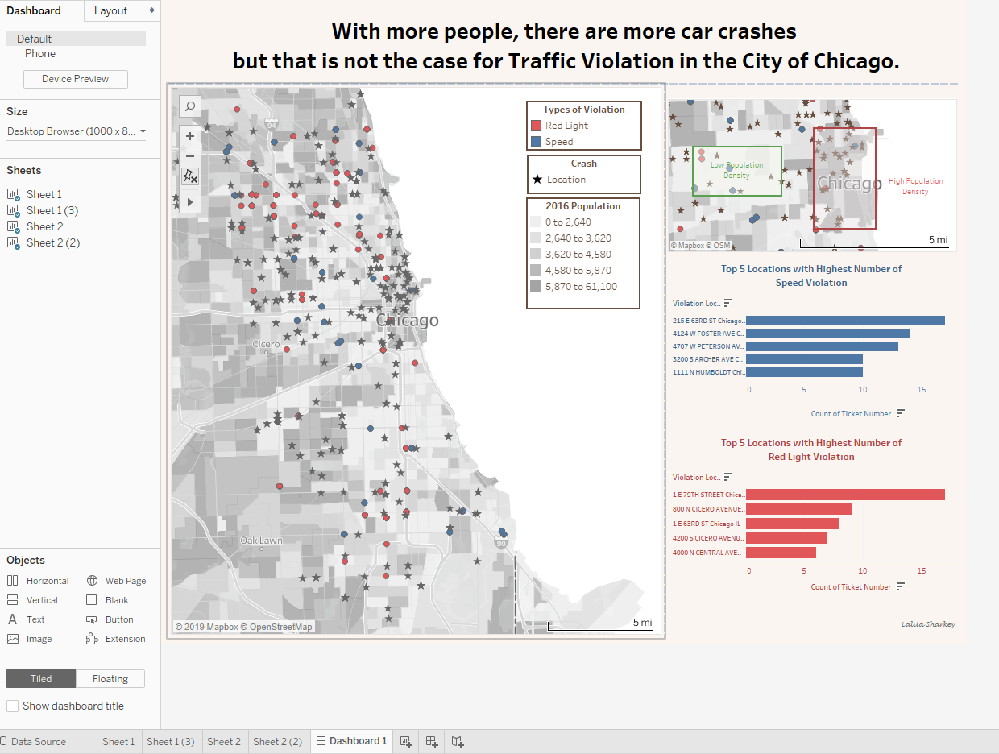

```{r setup, include=FALSE}
knitr::opts_chunk$set(echo = TRUE)
library(tidyverse)
library(ggmap)
```

## A selected questions and plot from Homework 7
#### Question: For each location, is there any correlation between the number of each violation type and the number of crashes? 


## Suggestion from Dr. Weigle 
The goal here is to make a finding and present it. With a slider, you're allowing more of an analysis/exploration by the user.  What is the main finding of your exploration of the data? If you want to show a map, you'll need to also consider population (there will naturally be more violations/crashes in highly populated areas).  This may be more than you can do in a week and is really more than what I'm asking for. 

## The Refined Chart


### Chart Explanation
According to the refined chart above, there are some cluttered of starts which in this chart are the car crash locations. Once take a closer look, the cluttered of stars lay on top of the darker shade of grey which are the area with high population denstity.  The observation implies that the higher number of population in an area has a strong correlation to the number of car crashes. To emphasis, a zoomed plot with the annotated area of both high and low population density was created.  However, the same can not be said regarding the number of traffic violations. To illustrate, In the high population density frame in zoomed plot, there are only a few traffice violation tickets had been issused. Whereas in the low population density frame, the number of traffic violation tickets is smaller comparing to the high population density area. Since the question asks for the correlation between the number of each violation type and the number of crashes for each location, I believe this chart answers the question pretty well. 

## Making the refined chart  
I created the refined version of the chart by mainly using Tableau. The reason for using Tableau is because I did the dashboard plot where it combines multiple charts. I also found a simple way to create a map with Tableau. Furthermore, I also found out that Tableau has a built-in data layer option where it directly imports population data to the map.  

**1. Used Python script with `geopy` to change violation address to latitude and longitude coordinates**   

```
from geopy.geocoders import Nominatim
from geopy.extra.rate_limiter import RateLimiter

rep = pd.read_csv('https://raw.githubusercontent.com/cs625-datavis-fall19/hw8-refine-LalitaSharkey/master/data/tickets.csv?token=ANAIY6L2JJV5XN5GYBI7XO255XP4Y')
rep.head()

geolocator = Nominatim(user_agent="tickets")
geocode = RateLimiter(geolocator.geocode, min_delay_seconds=1)
rep['violation_location'] = rep['violation_location'].map(str) + "Chicago IL"
rep['location'] = rep['violation_location'].apply(geocode)
rep['point'] = rep['location'].apply(lambda loc: tuple(loc.point) if loc else None)
get_rows = rep.point.notnull()
rep[['lt', 'ln', 'other']] = rep[get_rows].apply(lambda x:x.point,result_type='expand',axis=1)

with open('filelocation.csv', 'w') as f:
    rep.to_csv(f, encoding='utf-8', index=False)
```

**2. Imported the datasets to Tableau and join both table**  



**3. Moved generated latitude and longtitude to the shelfs**


**4. Set the map layer**  



**5. Added marks to the chart**  



**6. Create horizontal bar charts on another worksheets**  

To select only top 5 locations for each category, the filter option was used for 2 dimensional varibles which are `Unit Description` and `Violation Location`. 






**7. Created the zoomed plot with annotated population density areas**  



**8. Combined all worksheets into one dashboard and added the headline**  



## References  
https://community.tableau.com/thread/179770  
https://community.tableau.com/thread/294980  
https://help.tableau.com/current/pro/desktop/en-us/maps_dualaxis.htm  
https://help.tableau.com/current/pro/desktop/en-us/maps_howto_simple.html  


